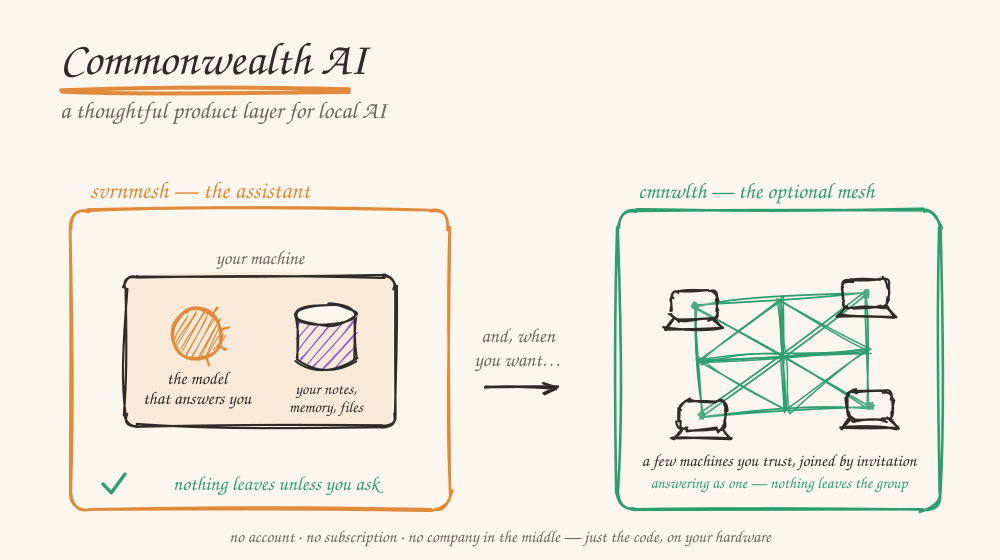
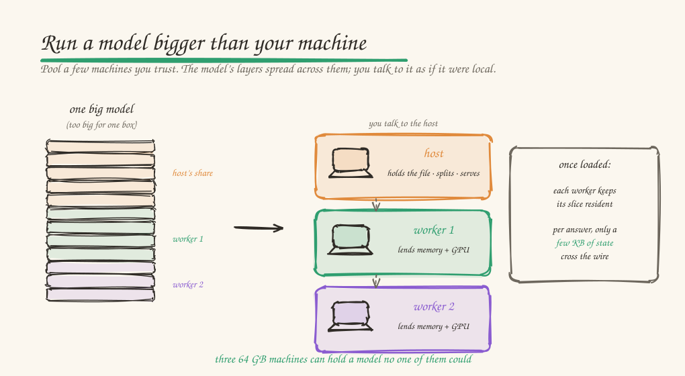

# Commonwealth AI

[](https://github.com/alexsbryan/commonwealth-ai/actions/workflows/ci.yml)
[](https://github.com/alexsbryan/commonwealth-ai/actions/workflows/docs-reconcile.yml)

<p align="center"></p>

An AI assistant that runs on your own computer — and across a few machines you trust when one isn't enough. The model that answers you lives on your machine, not in someone's cloud. Nothing leaves unless you ask.

- **svrnmesh** — the assistant you run. Write, search what you already know, think a problem through. The model is on the machine in front of you.
- **cmnwlth** — the optional mesh. Pool machines you trust to run a model none of them could hold alone, or share a knowledge base. No central server; nothing leaves the group.

## Get started

```sh
curl -fsSL https://svrnme.sh/install.sh | sh
svrn setup          # finds models that fit your hardware, downloads them, starts the daemon
svrn chat session   # start talking
```

That's the whole loop. Answers come grounded in sources you keep — your files, an Obsidian vault, Wikipedia, the Stanford Encyclopedia — searched before each reply and **cited**, so you can trace any claim back to where it came from. Your conversations, documents, and memory stay put, and it remembers what mattered across sessions. Web search is off by default; there's no telemetry.

Swap models live with `svrn model set primary <file>`. There's a desktop app too, and the daemon serves an OpenAI-compatible API you can point your own tools at — both in [the svrnmesh guide](./sovereign/README.md).

## Bring your own knowledge, or build a pipeline

<p align="center"></p>

Two things come down to one small TOML file, no code in between:

- a **recipe** turns a source — an Obsidian vault, a mailbox export, an API — into a searchable, cited corpus. What's yours stays `scope = "local"`: never advertised to peers, never copied off your machine.
- a **workflow** is a pipeline: read a folder, run a model over each item, call a tool between steps, save the results. Swap one line to repurpose the whole thing.

```sh
svrn corpus install email-archive --params path=~/Takeout/Mail/inbox.mbox
svrn workflow run my-pipeline.toml
```

[Build your first recipe](./sovereign-recipes/GETTING_STARTED.md) and [write a workflow](./docs/WRITE_A_WORKFLOW.md) each start from a copyable starter.

## Run a model bigger than your machine

<p align="center"></p>

Some models won't fit on one computer. Pool a second, or a few, that you or people you trust already own — the layers spread across them and you talk to it as if it were local. Three 64 GB machines can hold a model no one of them could.

We publish one measured number for this, not a benchmark of our best day: a 122B model split across an AMD mini-PC and a Mac on a home LAN decodes at **8.5 tok/s** (median of 5 runs). [A number you can check](./docs/A_NUMBER_YOU_CAN_CHECK.md) has the exact hardware, the commands, and — the actual point — how to get the honest number for *your* machines before you commit to anything.

```sh
svrn mesh create        # on the host, prints a key like cwth-a1b2-c3d4-e5f6
svrn mesh join <key>    # on each machine you're pooling in
```

[Run a model bigger than your machine](./docs/RUN_A_BIGGER_MODEL.md) walks it through. Pooling **knowledge** instead of compute works the same way — the [two-node quickstart](./docs/TWO_NODE_QUICKSTART.md) gets one machine a cited answer from a corpus that never leaves the other. (Already ran `svrn setup`? You quietly founded a solo mesh — read its key with `svrn mesh status`.)

## Code completion that explains itself

Ghost-text completion and repeated-edit suggestions, served by your own
daemon to VS Code, Cursor, or Windsurf. Make the same small edit twice,
pause, and the rest of the sites arrive as a queue you walk with Tab —
including the ones off-screen.

```sh
svrn setup --fim        # model + daemon config + editor extension, after showing you the plan
```

The part a cloud completion can't do: ask it why. Every suggestion —
and every *silence* — carries the reasoning that produced it, down to
which engine answered and which threshold held. [Next edit in your
editor](./docs/NEXT_EDIT_IN_YOUR_EDITOR.md) is the walkthrough, and it
does not need a model for the deterministic half.

## Going deeper

New here? The [ten-minute tour](./docs/ARCHITECTURE_TOUR.md) of the whole stack. To read or build the code: [SYSTEM_OVERVIEW.md](./sovereign/SYSTEM_OVERVIEW.md) maps every subsystem, [ARCH_PRINCIPLES.md](./sovereign/ARCH_PRINCIPLES.md) the design rules, and [SETUP.md](./SETUP.md) takes a fresh clone to a green test suite in about half an hour. Already using another agent harness, editor, or chat UI? [INTEROP.md](./docs/INTEROP.md) points it at a local daemon in five minutes; [INTEGRATION_SURFACES.md](./docs/INTEGRATION_SURFACES.md) marks contracts from internals.

## Contributing

One steward now, opening toward a commons. Recipes, documentation fixes, and interop configs are open for pull requests today; core architecture isn't yet, because the principles are still settling and I want that foundation solid before I start adjudicating what merges. Bug reports and ideas are always welcome. [CONTRIBUTING.md](./CONTRIBUTING.md) is the full and only statement of what I can merge — including [how to contribute a recipe](./CONTRIBUTING.md#contributing-a-recipe), the easiest way in. [GOVERNANCE.md](./GOVERNANCE.md) is who decides and where it's headed. Stuck on something? [SUPPORT.md](./SUPPORT.md) is where to start. Security or privacy: [SECURITY.md](./SECURITY.md), not the tracker.

---

*Free software under [AGPL-3.0-or-later](./LICENSE).*
