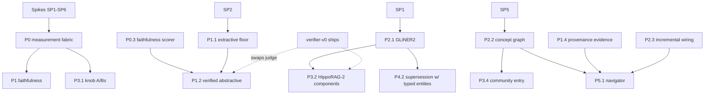

# Enrichment roadmap — engineering design + t-shirt sizing

_Status: due-diligence companion to
[`ENRICHMENT_ROADMAP.md`](./ENRICHMENT_ROADMAP.md) (intent per
`ARCH_PRINCIPLES.md §1.2`). Written 2026-07-29. Every design below is
anchored to seams verified against the code this day (file:line);
sizes are estimates, and the spike list in §1 exists precisely to
retire the low-confidence ones before money is committed._

**Sizing legend.** Unit = focused engineer-days on this codebase
(operator + agent fleet pairing, the normal working mode here).

| Size | Meaning |
|---|---|
| S | ≤ 1 day |
| M | 2–5 days |
| L | 1–3 weeks |
| XL | > 3 weeks — **must be decomposed before commitment; XL is a flag, not a budget** |

Machine-time (bench wall-clock, re-embeds, model downloads, enrich
rebuilds) is listed separately — it runs unattended and does not
compete for engineer attention, but it gates *calendar* time on
A/B-heavy items.

**Confidence.** High = seams verified + in-tree precedent. Med = design
clear, one real unknown. Low = spike required first.

---

## 1. De-risking spikes — buy the answers first (~1-1.5 weeks total)

The cheapest due diligence available: six questions whose answers move
sizes by weeks. Recommend running these as the first tranche regardless
of what else is funded.

| # | Question | Method | Exit criterion | Size |
|---|---|---|---|---|
| SP1 | Can GLiNER2 run in our Rust/ONNX stack? `gline-rs` is v1-only and its own Cargo.toml calls the `orp → ort =2.0.0-rc.9` pin fragile (`sovereign-gliner/Cargo.toml:5,34-37`) | Export `fastino/gliner2-base-v1` to ONNX; drive it with bare `ort` (no gline-rs); measure tok/s + RSS on M2 Max CPU | Entities + one relation schema extracted from 50 real chunks at ≥ v1 throughput | M (1-2d) |
| SP2 | Does extractive summarization hold retrieval parity on OUR banks? (SVD-RAG evidence stops at 205 chunks) | Offline: rebuild 3 corpora's trees with centroid-cosine sentence selection (no code integration — a script over existing `conv_raptor_nodes` members); run `bench/sep/summarize*` + book-report | Within the summarize banks' historical variance of the abstractive baseline | M (1-2d) + machine |
| SP3 | Judge throughput for the faithfulness lane: what does scoring one corpus's summaries cost? | Run `extract_claim_list`-style decomposition + judge over one vault's RAPTOR nodes with the resident model; extrapolate | $/corpus in minutes known; decision: judge-now vs wait-for-verifier per corpus size | S (0.5-1d) |
| SP4 | Does llama.cpp's rerank path work with Qwen3-Reranker GGUF on our slot infrastructure? | Load reranker in a spare slot; score 100 (query, chunk) pairs; latency per pair | < 20 ms/pair on M2 Max or a documented "no" | S-M (1-2d) |
| SP5 | Rust crates for noun-phrase extraction + Leiden/Louvain communities — adopt or write? | Survey + 200-line prototype over one wikipedia shard | Concept graph for 10k chunks in < 5 min CPU, communities that eyeball-cohere | M (1-2d) |
| SP6 | Late chunking feasibility on the 0.6B embedder: can the embed slot batch 8k-32k-token windows at acceptable memory? | Embed 20 long docs via long-window + post-pool vs status quo; compare notes_tiered-style recall on a small golden | Memory ceiling + recall delta known | S-M (1-2d) |

Spike outputs feed §4's go/no-go points. Total: **5-8 engineer-days.**

---

## 2. Engineering design + size, per workstream

### P0 — Make enrichment quality measurable

**P0.1 — Repair the HARD lane. `M (3-5d) · High`**
Design: in `bench_cmd/all.rs`, `classify_enrichment` (:847) unions
legacy named-field F1s with `axis_scores` (:851-867) into one diff set;
`FirstRun` auto-green (:659) becomes lane-configurable
`baseline_required` (enrichment sets it); `LaneBaseline`
(`bench_cmd/lane_baseline.rs`) gains `{model, prompt_version,
artifact_mtime}` fingerprints stamped at capture so a static-artifact
score is visibly static. Weekly `--rebuild` tier joins the existing
lint-gate/api-gate cadence lane in CI (`scripts/sovereign-ci-bench.sh`
already isolates the lane at :271-278). Threshold becomes
`max(0.5pt, eval-median spread)` read from an `eval-median` sidecar.
**The canary is the acceptance test**: a fixture that perturbs a
resolver constant (e.g. `ENTITY_MERGE_COSINE`) in a scratch build and
asserts the lane reds — the self-test the lane never had.
Machine-time: weekly rebuild of bk-book-1-class corpora (tens of
minutes).
Risk drivers: none structural; the code paths are small and owned.

**P0.2 — Over-extraction becomes a cost. `M (2-4d) · High`**
Design: `enrich_cmd/eval.rs` adds per-axis `unmatched_count` /
`unmatched_rate` (predicted atoms matching no expected and no forbidden
entry) alongside the forbidden-only FP (:977 stays for compat);
baselines carry it; the gate treats a rising unmatched_rate as
regression with its own tolerance. A `bench enrichment-adjudicate`
verb samples N unmatched atoms → judge verdict (real/junk) → calibration
report, establishing what fraction of unmatched mass is junk before we
tune thresholds against it.
Risk: judge-adjudication quality — mitigated by sampling + human
spot-check of the first batch.

**P0.3 — Faithfulness lane (and Stream B generator). `M-L (4-8d) · Med`**
Design: pure scorer in `sovereign-eval` (new `faithfulness.rs`,
following the scorer/orchestrator split the repo already enforces),
orchestrator in `bench_cmd/`. Pipeline per corpus: read
`conv_raptor_nodes` → for each node, member texts via
`direct_member_chunk_ids`/`evidence_chunk_ids`
(`sovereign-contracts/types/document.rs:466-504`) → claim decomposition
reusing the production splitter (`extract_claim_list`,
`runtime/grounding/judge.rs:375` — currently `pub(super)`; promote to
`pub(crate)` + re-export or lift the shared core into `sovereign-eval`)
→ per-claim supported/unsupported verdict via the bench judge seam
(`sovereign-eval/src/judge.rs`) now, verifier-v0 when shipped (same
interface: claim + evidence → verdict) → per-corpus unsupported-claim
rate, TRACKED lane + hard `bench gate` twin. Every scored tuple
`(member_chunks, claim, verdict)` is appended to a JSONL corpus — the
verifier's Stream B training feed, for free.
Machine-time: dominated by judge calls; SP3 prices it and picks the
per-corpus sampling rate.
Extension (separately sized, deferrable): same harness over System-4
symbol summaries vs symbol body (`code_intel_cache.json` pairs) —
`M (3-5d)`; System-1 fault lines — `M (2-4d)`.
Risk drivers: judge quality on summary-shaped claims (RAGTruth's lesson:
summarization hallucinations are the hard class); throughput.

**P0.4 — Retrieval-utility A/B lane. `M (3-5d) · High`**
Design: `bench enrichment-ablate <bank>` — an orchestrator that runs an
existing QA bank K times across a declared knob matrix
(`SOVEREIGN_RAPTOR_GROUNDING` 0/1, `SOVEREIGN_CONV_PPR_WEIGHT` sweep,
`SOVEREIGN_DOC_CLUSTER_WEIGHT` sweep, `--with-atlas` on/off), holding
model + corpus fixed, emitting one joined table (per-knob deltas on the
bank's own metrics) + a committed artifact. No new scoring — it composes
banks that exist (`bench/sep/summarize*`, `bench/conversation`,
`bench/notes_tiered`, chaos). This is the institutionalization of the
two A/Bs that were done by hand (chaos contamination; wikipedia
`--with-atlas` 50/71 → 79/83).
Machine-time: heavy (bank × knob grid) — runs overnight; the engineer
cost is the harness.
Risk: banks' sensitivity — some knobs may need bank extensions to show
signal (that finding is itself the deliverable).

**P0.5 — Metric holes (partially deferrable to Tranche 2).**
- Edge-F1 goldens for the two atom-golden corpora + scorer extension:
  `M (2-3d) · Med` (golden authoring is the cost; scorer is mechanical).
- Synthetic personal-corpus ER golden (Enron methodology, non-email
  register) + B³ scoring reuse: `M (2-3d) · Med`.
- Baselines for the five golden-without-baseline corpora: `S (run +
  commit) · High` + machine-time.
- Enron ER hard `bench gate` twin (currently ungated): `S (0.5d) · High`.

**Phase P0 core (P0.1-0.4): ~12-22 engineer-days.** With P0.5: +5-7.

### P1 — Faithful by construction

**P1.1 — Extractive floor for RAPTOR nodes. `M (3-5d) · Med (SP2 gates)`**
Design: `SummaryMode { Extractive, Abstractive }` on the builder config
(`raptor_atlas.rs`); extractive path selects member sentences by
cosine-to-centroid using existing chunk embeddings + a cheap
sentence-embed pass on candidates through the embed slot (0.6B — this
is the SVD-RAG idea implemented against our infra; full SVD scoring is
a drop-in alternative behind the same seam if the simple selector
underperforms in SP2). Extractive nodes stamp
`provenance = "extractive"`; the no-`"` grammar contract is replaced
for them by construction (they ARE quotes). Dropped-summary failure
modes (`raptor_atlas.rs:893-911`) fall back to extractive instead of
thinning.
Machine-time: tree rebuilds for A/B on summarize banks.
Risk: fluency/synthesis quality of extractive briefs for the
"summarize X" UX (SVD-RAG's own caveat: less fluent, ~1.8x longer) —
mitigated by P1.2 keeping abstractive where it verifies.

**P1.2 — Verifier-gated abstractive lift. `M (3-5d) · Med`**
Design: post-`summarize_one_cluster` hook: decompose summary → verify
claims against member texts (P0.3's scorer, same interface; judge until
verifier-v0 ships, then swap) → persist on pass; on fail, retry once
with the faithful prompt variant, then fall back to extractive + flag
into the existing correction-ledger surface
(`conv_tiered_provider.rs:916-1020` precedent). Config: per-corpus
`verify_summaries = on|sample(p)|off` — sampling keeps enrich
wall-clock bounded on big corpora until the verifier makes 100%
affordable.
Depends: P0.3 (scorer), P1.1 (fallback target).
Risk: enrich-time latency (each verified node adds claim-count judge
calls; SP3's number sets the default sampling rate).

**P1.3 — Version-stamped trees. `S-M (1-3d) · High`**
Design: add `prompt_version: u32`, `summarizer_model: String` to
`RaptorNode` (`sovereign-contracts/types/document.rs:466`) + columns in
`raptor_nodes`/`conv_raptor_nodes` (additive migration,
`sovereign-store/migrations.rs`); fold both into the checkpoint
`input_hash` (`raptor_checkpoint.rs:34` — currently only
`(chunk_id, embedding-byte-count)`, exactly the gap the fabrication
note flagged; `manifest.schema_version` exists for the migration).
`enrich raptor --refresh-stale` rebuilds only trees whose stamp lags
the current prompt — incremental by the existing per-note checkpoint.
Mirrors the `(model, fingerprint)` discipline PhaseCache already has.

**P1.4 — Provenance-aware evidence. `M-L (5-10d) · Med`**
The audit *improved* this item's outlook: `EvidenceContext`
(`runtime/grounding/mod.rs:99-128`) already carries parallel per-chunk
metadata (`chunk_labels: Vec<Vec<String>>`) and a shared builder exists
(`handlers/synthesis_common.rs:115`), so the shape change is
precedented and partially centralized.
Design: add `chunk_sources: Vec<EvidenceSource>` (enum:
`Leaf | RaptorSummary | CodeIntelSummary | AtlasBrief | ToolTranscript`)
parallel to `chunks`, populated in `synthesis_common.rs` + the direct
construction sites (`streaming.rs:1435, :2638`,
`knowledge_query.rs:1574`, `simple.rs:180`; grep-verified list). Gate
policy in `verify_grounding`: claims classified factual/specific must
find support in `Leaf`-class evidence; summary-class evidence supports
thematic/structural claims (the chaos witness contract, extended into
the evidence path). Emptiness degrades to today's behavior — additive,
mesh-safe.
The real cost is not plumbing but **re-calibration**: chaos
(two-red-line), governance Lane B, and the summarize banks must be
re-run and RL-2 must stay 0 — expect one tuning loop on the
factual/thematic claim classifier.
Machine-time: the full re-validation suite, several nights.
Risk drivers: gate behavior change on live surfaces; the classifier
boundary (factual vs thematic) is the judgment call.

**P1.5 — Same contract for Systems 1/4.** Covered as P0.3 extensions +
policy reuse; incremental cost `M (3-5d)` when scheduled.
**Phase P1: ~15-28 engineer-days**, chaos double-gate
(competence ≥ 0.71 AND honesty ≥ 0.82) as the exit criterion.

### P2 — Extraction economics

**P2.1 — GLiNER2 generation. `L (8-15d) · Low→Med (SP1 gates)`**
Design (assuming SP1's ONNX path lands): new backend module in
`sovereign-gliner` driving bare `ort` (dropping the fragile
gline-rs/orp chain is itself a win), schema-driven API
(`ExtractionSchema { entities: [...], relations: [...], attributes }`)
behind the existing `ChunkEntityExtractor` seam
(`corpus-engine/enrichment/tiered.rs:64`) so corpus-engine never sees
the model generation. Rollout order: conversation/vault path (fixing
type-collapse by joint typing), document T2 (retiring the LLM
fallback), then **candidate-atom seeding**: GLiNER2
entities/relations become deterministic Entity/Relation candidates
with a new `EdgeProvenance::EncoderExtraction` variant (additive enum +
CSR byte), shrinking Phase-1's LLM surface to judgment. Recipe
`[[enrichment.entity_types]]` compiles to a schema (the investigation
pipeline already declares exactly this shape).
Fallback if SP1 fails: v1-family multi-task checkpoints (NuNER/GLiNER
multi) on the existing runtime — half the benefit, S-M integration.
Risk drivers: ONNX export fidelity for the multi-task head; `ort` API
churn (the rc-pin problem transfers).

**P2.2 — Concept-graph free tier. `L (10-15d) · Med (SP5 gates)`**
Design: `corpus-engine/src/enrichment/concept_graph.rs` — noun-phrase
extraction (SP5's crate or heuristic), co-occurrence edges with
window + df pruning (the TF-IDF motif code in `document_asset.rs:2725`
region is the in-house precedent for the term-statistics half),
Leiden/Louvain communities, persisted as a Lance/SQLite sidecar
(`concept_graph.lance` + community table, following the
`raptor_summaries.lance` sibling-table pattern). Hooks: ingest-time
build (post-embed, budgeted), Phase-1 seed vocabulary, community entry
points for retrieval (P3.4), and the P5 navigator's frame. Explicitly
LazyGraphRAG's index half; the query half arrives with P5.
Risk drivers: noun-phrase quality without a POS model (SP5 answers);
community stability under incremental adds (v1: rebuild communities on
threshold drift — they're cheap).

**P2.3 — Wire the incremental machinery. `~8-13d total · High/Med`**
Sub-items, independently landable:
(a) `SOVEREIGN_ATLAS_INCREMENTAL` becomes the default host path via
`apply_atom_delta` when a delta is computable — the flag is read today
and unused; the work is the end-to-end delta test + the host branch
(`M 3-5d`).
(b) Watched-folder sweeper routes through the GLiNER delta hook
(`extract_delta_for_corpus` exists; the sweeper bypasses
`CorpusEngine::ingest`) (`S-M 1-2d`).
(c) Attached docs gain `display.category` so Phase-B incremental
reaches them (`S 0.5-1d`).
(d) Code-atlas patch gaps: recompute incoming `ScipStructural` edges +
salience for touched atoms via a bounded repair pass over the reverse
CSR (`code_walk.rs:1551-1557` documents the drop sites) (`M 3-4d`).
(e) `verify-v2` upgraded from count-equality to sampled edge-set
equality so (d)'s class of drift is detectable (`S-M 1-2d`).

**P2.4 — Structural contextual embedding. `M (3-5d) · Med` + machine**
Design: an embed-text assembler at the chunk-embed stage — stored text
stays clean; the *embedded* string is `[doc: …] [section: …]
[entities: …]\n<chunk>` built from artifacts we already have. Because
vectors change, this is **per-corpus opt-in at build time**, recorded
in `_corpus_meta.json` next to the embed-model stamp (same
compatibility discipline as `EmbedModelInfo` — augmented and
non-augmented corpora must not be confused, and mesh peers inherit the
stamp). A/B on notes_tiered failure classes + one QA bank before any
default flip; existing corpora migrate only by explicit re-embed.
Late chunking is the follow-on behind SP6, separately funded
(`M-L`), not counted here.

**P2.5 — Retire measured waste + hygiene table. `S-M bundle (1-2d) · High`**
The ten §6 roadmap items plus the debouncer type-check
(`debouncer.rs:271` vs `manager.rs:455`) and the newly caught
`RaptorNode` "GMM centroid" docstring (code is hard k-means).

**Phase P2: ~30-50 engineer-days**, exit = wiki-class atlas build in
hours + incremental-by-default with detectability.

### P3 — Retrieval-side exploitation (evidence-gated)

**P3.1 — Settle the dark knobs. `M (3-5d glue) · High` + heavy machine**
All four knobs are env-vars already; the work is P0.4's matrix runs +
baseline commits + default flips where won. Note the dependency
honestly: today no bank isolates conv-retrieval recall (notes_tiered
scores NoteStore blend; conversation bench scores answers) — if P0.4
shows the banks can't separate a PPR-weight signal, a small
conv-retrieval golden gets authored here (`+M 2-3d`).

**P3.2 — HippoRAG-2 components, scoped prototype. `L (8-12d) · Med`**
Design: on the conversation graph — passage-node integration first
(chunk nodes partially exist as synthetic `chunk-<id>` nodes in
`conv_entity_graph.rs`; formalize contains-edges + balanced reset mass,
HippoRAG-2's highest-value ablation at −13% without), then
query-to-triple seeding (needs P2.1 relations; a degraded entity-pair
variant can prototype earlier), verifier-v0 as the recognition-memory
filter over candidate triples (their ablation: +1.7). Adoption gate:
the P0.4/P3.1 recall lanes — this is the honest re-litigation of
`TIERED_RETRIEVAL.md:334-374`, and "no" remains an acceptable answer.

**P3.3 — Persist the entity graph + reranker. `M (4-7d) · Med (SP4 gates)`**
Graph persistence + LRU keyed on `(corpus, conv, graph_version)`
replacing per-query rebuild (`S-M 2-3d`). Qwen3-Reranker as an optional
final stage on the hybrid path behind SP4's latency verdict
(`M 2-4d`): new optional slot role, budget-capped candidate set (top-20
→ rerank → top-5), A/B'd on notes_tiered.

**P3.4 — Community entry points for LanceDB corpora. `M (3-5d) · Med`**
Depends P2.2. Entity-poor queries route community → members → leaf
retrieval; DRIFT's pattern on our substrate.

**Phase P3: ~18-29 engineer-days** engineer-side; calendar dominated by
bench nights.

### P4 — Time as a first-class dimension

**P4.1 — Bi-temporal envelope fields. `M (3-5d) · High`**
`valid_from/valid_to/observed_at` on State/Relation/Claim
(`#[serde(default)]`, schema 2.3 → 2.4 per the back-compat convention);
v2 store: hot columns for validity bounds (the payload column carries
the rest losslessly — cheap because ATLAS_STORAGE_V2 kept full
envelopes).
**P4.2 — Supersession via reconciliation. `M-L (5-8d) · Med`**
A contradiction signal (same subject + incompatible State/Claim,
identity-grade keys only — the reconciliation lesson) closes the old
atom's window + writes a `Supersedes` edge, as a reversible oplog op
(Merge/Split precedent). Governance mootness
(`ActiveSet.tension_pairs` join) is the in-house prior art to
generalize.
**P4.3 — Temporal query surface. `M (3-5d) · Med`**
`atlas-query --as-of`, current-state filtering to open windows in the
brief assembler + chat typed path for `temporal_slice`/`trend`
archetypes.
**P4.4 — Bench. `M (2-3d) · High`**
Planted correction scenario ("X, later corrected to Y") + temporal
archetype scoring in `bench/conversation`.
**Phase P4: ~13-21 engineer-days.**

### P5 — Frontier bets (decompose before commitment)

**P5.1 — Navigator. `XL — not sized for commitment.`**
Fund only the evidence probe now: a budgeted tree-descent answerer over
existing RAPTOR trees for the summarize banks (`M 4-5d`) — LazyGraphRAG
budget semantics, MatchTrace-style hop logging. Full scope (concept
communities + atom CSR + claim write-back via `apply_atom_delta` +
verifier gating) is a 4-8 week program that should be re-planned after
P1/P2 land, since three of its four substrates arrive there.
**P5.2 — Visual assets. `XL — not sized for commitment.`**
Fund spikes only: pdfium page-raster + ColModernVBERT ONNX single-page
score (`M 2-3d`), multi-vector MaxSim storage prototype on the
sibling-table pattern (`M 1-2d`). Full integration re-planned after
spikes.

---

## 3. Dependency graph

Verifier-v0 is deliberately a dotted edge everywhere: every consumer has
a judge-based interim, so this program never blocks on that one.

---

## 4. Roll-up and tranche plan

| Phase | Engineer-days | Confidence-weighted | Machine-time profile |
|---|---|---|---|
| Spikes | 5-8 | High (that's their job) | light |
| P0 core (0.1-0.4) | 12-22 | High | weekly rebuilds + judge runs |
| P0.5 extension | 5-7 | Med | bench nights |
| P1 | 15-28 | Med | re-validation suites |
| P2 | 30-50 | Med (SP1/SP5 gate 2 items) | re-embeds, tree rebuilds |
| P3 | 18-29 | Med | heavy bench nights |
| P4 | 13-21 | Med-High | light |
| P5 probes only | 7-10 | Med | moderate |
| **Total, probes included** | **~105-175 days (≈ 21-35 weeks)** | | |

That total is the *whole program*; the recommendation is to commit it
in tranches with kill-points, not as one block:

**Tranche 1 — "Trust" (commit now): spikes + P0 core + P1 + P2.5
hygiene ≈ 33-63 days (7-13 weeks).**
Exit gates: the canary proves the lane can fail; faithfulness rate
reported per corpus; chaos double-gate (competence ≥ 0.71 AND honesty
≥ 0.82) met with enrichment ON; all six spike answers written down.
Kill-point: if SP2 shows extractive parity fails badly on our banks,
P1.1/P1.2 re-plan around verified-abstractive-only (P1 shrinks; the
faithfulness contract stands).

**Tranche 2 — "Economics" (commit after T1 exit): P2 + P0.5 + P3.1 ≈
41-67 days (8-13 weeks).**
Exit gates: wiki-class atlas in hours; incremental default with
verify-v2 detectability; dark knobs settled by committed A/Bs.
Kill-points: SP1 fail → GLiNER2 becomes v1-multitask fallback (P2.1
drops to S-M); SP5 fail → concept graph v1 ships entity-co-occurrence
only (P2.2 halves).

**Tranche 3 — "Memory + multi-hop" (evidence-gated): P3.2-3.4 + P4 ≈
28-45 days (6-9 weeks).**
Entry condition, not just exit: P3.2 starts only if T2's recall lanes
show headroom that summary-side fixes didn't close (the recorded prior
gets its honest test).

**Tranche 4 — "Bets": P5 probes (in T1/T3 slack), full P5 re-planned
after T2.**

## 5. What this exercise changed vs. the roadmap

1. **P1.4 got cheaper.** `EvidenceContext` already has parallel
   per-chunk metadata and a shared builder (`synthesis_common.rs:115`)
   — the design is an additive parallel vec + policy, so the size is
   M-L with re-calibration dominating, not the L+ the roadmap implied.
2. **P2.1 got riskier, explicitly.** gline-rs is v1-only atop a
   self-described fragile `ort` rc-pin; GLiNER2 has no proven Rust
   path in-tree. Hence SP1 as the very first spike, and a named
   fallback.
3. **The checkpoint gap is confirmed exactly as noted**:
   `input_hash` = `(chunk_id, embedding-byte-count)` only
   (`raptor_checkpoint.rs:34`) — P1.3 is small and surgical.
4. **`extract_claim_list` is reusable but `pub(super)`** — the
   faithfulness lane needs a one-line visibility change or a shared-core
   lift, not new claim-splitting machinery.
5. One more hygiene item found: `RaptorNode` docstring says "GMM
   centroid"; the builder is hard k-means (`raptor_atlas.rs:1030`).

## 6. Decision points surfaced for the operator

Not blockers — defaults are proposed; flag disagreement before the
relevant tranche starts.

| Decision | Proposed default |
|---|---|
| Extractive floor: default for all new trees, or opt-in per corpus? | Default for memory corpora (vault/conversation) after SP2 parity; abstractive-verified stays default for attached docs where fluency is the product |
| Verification blocking vs. flagging at persist time | Blocking with extractive fallback (never persist unverified abstractive); sampling rate from SP3 until verifier ships |
| P2.4 re-embed existing corpora or new-builds-only | New-builds-only + explicit `corpus expand`-style migration verb; never silent re-embed (mesh compat) |
| GLiNER2 path if SP1 partially succeeds (entities yes, relations no) | Adopt for entities/types; keep relations on the LLM judgment path until the runtime matures |
| Where the faithfulness JSONL (Stream B) lives | `sovereign/bench/faithfulness/` next to the other banks, git-tracked sampled subset + full local artifact |

_Proposed first commit of the program: the T1 spike bundle — it is one
week, it retires the three lowest-confidence sizes above, and nothing
in it is wasted regardless of which tranches get funded._
