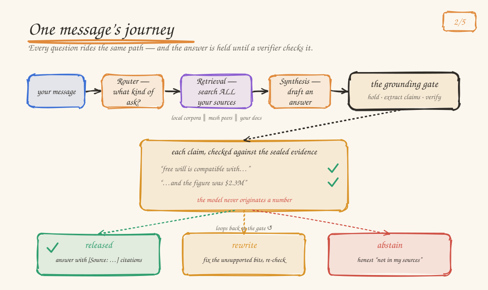
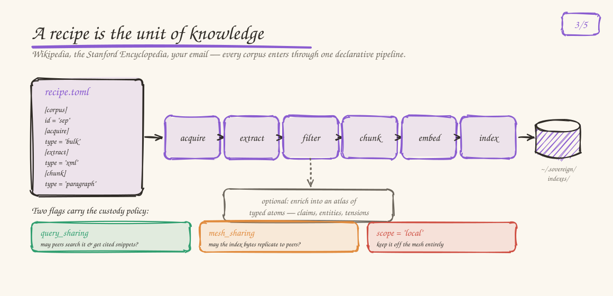
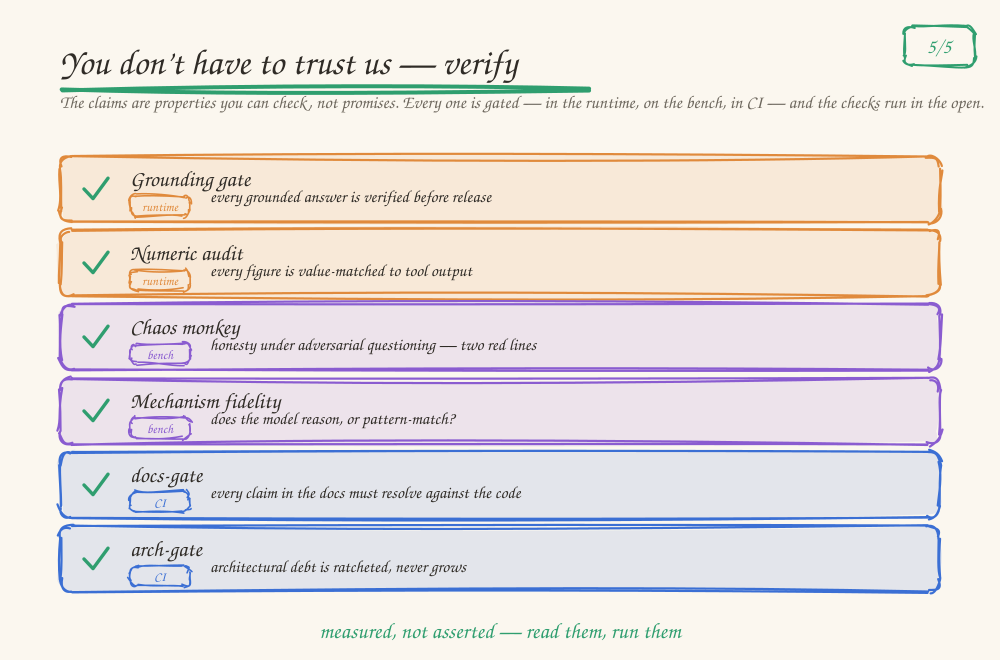

# Commonwealth AI — the ten-minute architecture tour

An AI assistant that runs on your machine — and proves what it says.

Commonwealth AI is two products sharing one Rust workspace. **svrn**
is the assistant: local models, local knowledge, every answer retrieved
from sources you chose and *verified before you see it*. **cmnwlth**
is the optional mesh: pool machines you trust to run models none could
hold alone, or query each other's knowledge — without the knowledge ever
leaving its owner.

The house style is **glassbox**: every layer is inspectable, every claim
in the docs is machine-checked against the code in CI, and quality is
measured by adversarial benches — *gates, not vibes*.

| | |
|---|---|
| Workspace | 4 projects, one Rust workspace |
| Tests | thousands — none require GPU, network, or model weights |
| Knowledge pipeline | 24 extractors · 7 chunkers, all recipe-declared |
| CLI | 55 verbs behind one `svrm` dispatcher |
| Telemetry | none — nothing phones home |

> This tour is a *rendering* for newcomers (figures as of July 2026).
> The verifiable contract is [`sovereign/SYSTEM_OVERVIEW.md`](../sovereign/SYSTEM_OVERVIEW.md) —
> when they disagree, the contract wins. Rules of engagement:
> [`sovereign/ARCH_PRINCIPLES.md`](../sovereign/ARCH_PRINCIPLES.md).
> How it came to be this shape: [`sovereign/HISTORY.md`](../sovereign/HISTORY.md).

---

## 1. The pieces, and what each is for

There are only a few parts, and each has one job. **Sovereign** is the
assistant you talk to — the whole loop (CLI, desktop, or server) running on
your machine. It composes two things: **a local model** that answers you on
your own hardware, and **corpus-engine**, which turns your sources — notes,
email, Wikipedia — into knowledge it can search and cite. **cmnwlth** is
optional: pool machines with people you trust and it federates both, so a
group can run a bigger model together or share knowledge that never leaves
its owner's disk.

Under the hood it speaks the ordinary **OpenAI API** — point any
OpenAI-compatible tool at the daemon and it just works. **OICP** (the Open
Inference Capabilities Protocol) is only a thin, additive layer on top of that,
so nodes can advertise what they're good at; it's a detail, not the point. The
dependency graph is clean (each part speaks to the next through traits, and the
knowledge layer never knows about the assistant), yet nothing here is the
"foundation everything rests on" — the real base is that you can read the source
and check every claim yourself.

Surfaces: `sovereign-cli` (+ 3 sibling binaries), `sovereign-desktop` (Tauri 2 + Svelte), `sovereign-server` (`:8080`, multi-tenant, the phone's host), `sovereign-mobile` (thin client). The runtime is `router → policy → retrieval → synthesis → grounding gate` over `sovereign-core · -inference (llama.cpp) · -tools · -store · -mesh · -eval`; the wire types live in `oicp-types`.

*Deep dive: SYSTEM_OVERVIEW §1–§2 (project map, per-crate table).*

## 2. One message's journey: nothing ships unverified

This is the pipeline every question rides. Two ideas make it unusual:

- **The intent decides *how* to answer, never *where* knowledge lives.**
  Every install's sources — local corpora, mesh peers, ingested documents —
  are searched regardless of route.
- **The answer is held until a verifier checks its claims against the
  sealed evidence** — release, rewrite, or honestly abstain. Streaming
  paths narrate while the gate holds.

The gate is belt-and-suspenders: an LLM judge checks each claim against the
evidence, and deterministic vetoes run beside it — garbled `[Source:]` labels
snap to the real source, invented code identifiers are refused, and a
**numeric audit** guarantees *the model never originates a number*, every
figure value-matched against tool output. `ComplexTask` rides the same gate,
plus an idempotency ledger (tool steps run exactly once across crash and
replay) and a Delegate firewall (the worker sees raw output; the orchestrator
sees only a typed contract).

*Deep dive: SYSTEM_OVERVIEW §4 — runtime data flow, retrieval pipeline,
grounding gate, role layer. Code: `sovereign-core/src/runtime/`
(`router_bootstrap.rs`, `retrieval_pipeline.rs`, `grounding/`,
`streaming.rs`).*

## 3. The knowledge layer: a recipe is the unit of knowledge

Every corpus — Wikipedia, the Stanford Encyclopedia of Philosophy, your
email archive — enters through the same declarative pipeline, described
by a TOML **recipe**. Recipes are the designed first contribution: pure
TOML, back-compat disciplined (serde defaults, aliases, deprecation
arms, regression fixtures), useful at n=1.

Two flags in every recipe carry the custody policy, enforced in separate
code paths:

| Flag | Question it answers | Enforced at |
|---|---|---|
| `query_sharing` | may mesh peers run federated searches and receive cited snippets? | capability advertising (`sovereign-mesh/src/capabilities.rs`) |
| `mesh_sharing` | may the index *bytes* replicate to peers? | storage-snapshot replication + index transfer |
| `scope = "local"` | keep this corpus off-mesh entirely | both |

SEP ships `query_sharing = true, mesh_sharing = false`: queryable,
never copied.

*Deep dive: SYSTEM_OVERVIEW §3. Schema SSOT: `corpus-engine/src/recipe.rs`.
Try it: `svrn corpus install sep` — or put your own inbox in:
export from Gmail (Google Takeout) or Apple Mail (File → Export Mailbox),
then `svrn corpus install email-archive --params path=~/inbox.mbox`.
Mbox, maildir, and `.eml` folders are detected by content; the corpus is
`scope = "local"` — structurally off-mesh.*

## 4. The mesh: chunks travel, corpora don't

A mesh is founded with a join key (BLAKE3-hashed, shared out of band)
plus an Ed25519 proof-of-possession; membership converges by gossip
every 10 seconds. It buys you two things: **federated knowledge** and
**models bigger than one machine** (tensor-split inference).

A cross-corpus query, custody preserved end to end:

The asking node searches its peer's `/internal/knowledge/search` on a 3-second per-peer budget. `query_sharing = true` lets the peer answer; `mesh_sharing = false` refuses replication of its index *independently* of query access — flip it to `true` and the corpus can live on several machines you allow, replicated on purpose. Peer offline ⇒ the asker degrades to local, never breaks.

**Two transport modes.** By default a mesh runs **trusted-network mode** — you
pool machines on a network you already control (a tailnet, WireGuard, your
LAN), and since the iroh migration even this dials peers over encrypted QUIC
first. Turn on **encrypted mode** (`require_encryption`, founder-set) and every
node moves onto iroh QUIC/TLS, dial-by-key, fail-closed — no plaintext path,
relays self-hostable. The one exception, either mode, is multi-host
tensor-split RPC, which stays raw TCP; we don't claim end-to-end encryption
while it's in use.

*Deep dive: SYSTEM_OVERVIEW §5; [`docs/THREAT_MODEL.md`](./THREAT_MODEL.md);
hands-on: [`docs/TWO_NODE_QUICKSTART.md`](./TWO_NODE_QUICKSTART.md). The
custody split is pinned by `sovereign-mesh/tests/knowledge_fanout_e2e.rs`
and `tests/local_only_corpus_locality.rs`.*

## 5. The trust machinery: every layer has a gate

The project's real asset isn't any subsystem — it's that correctness is
*measured*, adversarially, at every layer, and the measurements gate the
work.

| Gate | Layer | Guards | How |
|---|---|---|---|
| Grounding gate | runtime | every grounded answer, live | claims verified against the sealed corpus before release; deterministic vetoes; rewrite or grounded abstention |
| Numeric audit | runtime | every number in analytics answers | "the model never originates a number" — prose figures value-matched against tool outputs |
| Chaos monkey | bench | honesty under adversarial questioning | two red lines scored separately — competence when the answer is present, honesty when it's absent — never blended |
| Mechanism fidelity | bench | does the model *reason* or pattern-match? | metamorphic probes, anytime-valid stopping; per-model results persist as **fidelity cards** |
| Workspace suite | CI | every crate | thousands of tests; no GPU/network/weights required — breaking that is a regression |
| docs-gate | CI | the documentation contract | every cited path must resolve; extractor enum + every crate must be mentioned; machine-local citations fail the build |
| arch-gate | CI | architectural debt | file-size ratchet (>1,200 lines frozen via baseline, only allowed down) + the §1 project map must resolve on disk |
| Drift toolchain | mesh-side | docs vs code, semantically | LLM-bound reconciliation (drift detect, capability-reconcile, spec↔code fact pipeline) runs on your own hardware |

**To check whether your own change regressed any of this:
`./scripts/sovereign-ci-bench.sh --quick` (~35-40m) — the one bench that
composes every lane above into a single verdict. Start at
[`sovereign/bench/README.md`](../sovereign/bench/README.md); read a
verdict with [`sovereign/docs/RUNBOOK.md`](../sovereign/docs/RUNBOOK.md)
§6. The workspace lint/test scripts are the *build* gate and never run a
model against a question bank — they stay green through an
answer-quality regression.**

*Deep dive: SYSTEM_OVERVIEW §4 (gate) and §7 (build/test); benches under
[`sovereign/bench/`](../sovereign/bench/README.md); CI gates in
`corpus-engine/xtask/`.*

## 6. Surfaces and ports: who can reach what

| Port | Surface | Default exposure |
|---|---|---|
| `:9741` | client API — OpenAI-compatible `/v1/*`, Ollama shim `/api/*`, MCP `/mcp`, mesh apps | **loopback**; any remote caller needs a bearer token (fail-closed); MCP is loopback-only |
| `:9742` | internal mesh — gossip, join, scheduling, knowledge fan-out | **perimeter-trusted** in trusted-network mode (encrypted-QUIC-first); loopback + iroh-only in encrypted mode |
| `:8080` | `sovereign-server` — multi-tenant REST/WS, the phone's host | **loopback**; refuses to start non-loopback without auth keys (explicit opt-out exists) |
| `:50052` | tensor-split RPC (multi-host inference) | **raw TCP, no auth/TLS** — perimeter only, opt-in via env |

*The full surface-by-surface posture, including the honest gap ledger:
[`docs/THREAT_MODEL.md`](./THREAT_MODEL.md). Reporting: [`SECURITY.md`](../SECURITY.md).*

**Configuration & state, in one breath.** Everything mutable lives on four
roots: committed contracts in the repo (`quality/*.toml`,
`sovereign/docs/cli-contract.toml`, `sovereign/models.toml` — reviewed like
code, several machine-enforced); the per-checkout `.sovereign/` dir (project
identity, notes, ATOS state); the per-user root `~/.svrnmesh` (legacy
`~/.svrnmesh` symlink) holding `config.toml` and every index, model, and
report; and the platform data dir for the shared mesh identity. Two rules
keep it coherent: paths are derived only through the
`sovereign_contracts::rebrand` / `sovereign_cli_shared::dirs` accessors
(clippy-banned otherwise), and every env-var knob is declared in
`quality/env-flags.toml` (gate-enforced; rendered at `docs/ENV_FLAGS.md`).
The full map: [`sovereign/SYSTEM_OVERVIEW.md`](../sovereign/SYSTEM_OVERVIEW.md) §8.1.

## 7. Where to start

1. **Run it.** `svrn setup` then `svrn chat` — the
   [README](../README.md) quickstart gets you a cited answer from a local
   corpus in one sitting.
2. **Feel the mesh.** [`docs/TWO_NODE_QUICKSTART.md`](./TWO_NODE_QUICKSTART.md) —
   a corpus that answers from another machine without ever leaving it.
3. **Read the contract.** [`sovereign/SYSTEM_OVERVIEW.md`](../sovereign/SYSTEM_OVERVIEW.md) —
   the full map this tour compresses; its §8 is the "where do I look for X" index.
4. **Learn the rules.** [`sovereign/ARCH_PRINCIPLES.md`](../sovereign/ARCH_PRINCIPLES.md) —
   how design trade-offs get decided here.
5. **Make your first change.** A **recipe** for a data source you care
   about is the designed on-ramp: TOML only, tested by
   `commonwealth recipe test`, valuable at n=1.
   [`CONTRIBUTING.md`](../CONTRIBUTING.md) has the loop.

Agents get a faster path: a code-intelligence MCP server rides the
daemon at `localhost:9741/mcp` — compiler-resolved `symbols` / `callers`
/ `blast` beat grep — and `.claude/CLAUDE.md` is the operating manual.

## 8. Vocabulary you'll meet in the first hour

| Term | Meaning |
|---|---|
| corpus | one installed knowledge source — a directory of vectors + text under `~/.svrnmesh/indexes/` |
| recipe | the TOML that declares how a corpus is acquired, extracted, chunked, indexed, and shared |
| chunk | the retrieval unit: a passage with embedding, source document, and provenance |
| atom / atlas | enrichment output: typed knowledge units (claims, entities, tensions) and the columnar graph over them |
| intent | the router's verdict on a message: Simple / Knowledge / Deep / ComplexTask / Generative… |
| slot | a loaded model role — `fast`, `primary`, `embed` — planned onto hardware |
| gate | any hold-until-verified checkpoint; unqualified, it means the runtime grounding gate |
| seal | a conversation's corpus scope — verification may widen *search*, never the scope |
| mesh | a trust ring of nodes sharing inference and knowledge via gossip; founded by a join key |
| OICP | Open Inference Capabilities Protocol — how nodes advertise and select capabilities (CC0 spec) |
| fidelity card | a model's persisted mechanism-fidelity verdict: characterize once, read free |
| work atlas | cross-mesh peer awareness — who (human or agent) is working where, right now |
| ATOS | agent task orchestration — feature lifecycle for agent-driven work (opt-in) |
| drift | docs claiming what code no longer does; hunted by CI gates and mesh-side reconciliation |

*Full glossary: SYSTEM_OVERVIEW §9.*
