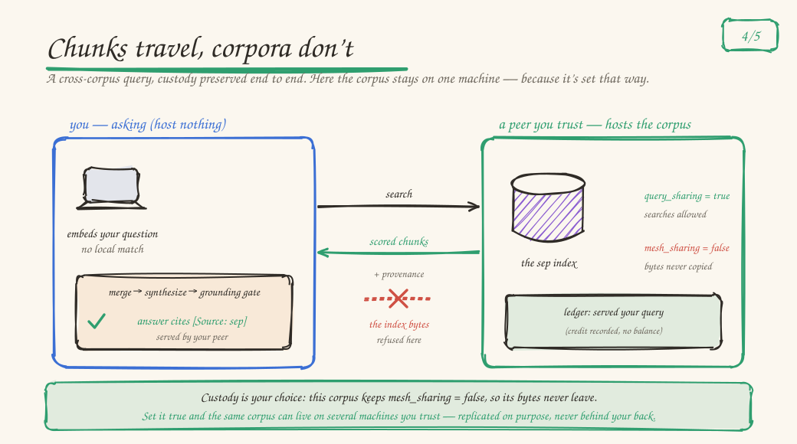

# Two-Node Quickstart: a cited answer from a corpus that never leaves its machine

The federation claim, made concrete in one sitting: two machines, a
knowledge corpus that lives on only one of them, and a sourced answer on
the other — where what crossed the network was retrieval snippets, never
the corpus itself.

<p align="center"></p>

At the end you'll have:

- **Node A (founder)** hosting a corpus.
- **Node B (joiner)** asking a question and getting an answer whose
  `[Source: …]` citations draw on A's corpus, served over the mesh.
- A contribution-ledger entry on A recording that it served B's query —
  and the corpus bytes still only on A.

## Before you start

- Each machine [set up and running the daemon](./START_THE_DAEMON.md).
  One asymmetry worth knowing: the machine that *asks* does the
  synthesis, so it needs a real primary model (~2.5 GB at the CPU-only
  floor); the machine that only *hosts* knowledge works with the
  embedding model and its corpus.
- Both machines [joined into one mesh](./JOIN_A_MESH.md) — that page has
  the ports, the join key, the relay form for networks where mDNS can't
  see across, and what "a mesh already exists" means. Come back when
  `svrn mesh status` on either machine shows `[2/2 online]`.

## 1 — Give A knowledge that B doesn't have

On node A:

```sh
svrn corpus install sep      # Stanford Encyclopedia of Philosophy, ~0.5 GB
```

`sep` is the deliberate choice here, because its recipe encodes the
custody story this quickstart demonstrates:

- `query_sharing = true` — mesh peers may run federated searches
  against A's copy and receive cited snippets (fair use).
- `mesh_sharing = false` — byte-level replication of the index to
  peers is refused. The corpus never leaves A.

Those are two independently enforced gates, not one flag: fan-out
advertising filters on `query_sharing`
(`sovereign-mesh/src/capabilities.rs`), while the replication and
storage-snapshot paths filter on `mesh_sharing`. A corpus can be
queryable-but-never-copied (sep), or fully private (both `false`, or
`scope = "local"` to keep it off-mesh entirely).

(If `sep` isn't fetchable from your network, any corpus works for the
mechanics — `svrn corpus list` shows the catalog; the `gutenberg`
catalog plus one `gutenberg-<id>` work is the fastest public-domain
alternative.)

## 2 — Ask from node B

On node B, which hosts nothing:

```sh
svrn chat
> Is free will compatible with determinism?
```

What happens under the hood: B embeds the query locally, finds no local
corpus, and its daemon fans out to A's `/internal/knowledge/search`
(3-second per-peer budget). A returns scored chunks — text snippets
with corpus and chunk ids, not files. B merges them into its retrieval
context, synthesizes locally, and the grounding gate verifies the
answer against that evidence before showing it. The `[Source: …]`
header names the corpus that answered, attributed to the peer that
served it.

## What just happened — the custody ledger

- **Chunks moved; the corpus didn't.** The knowledge-search response
  carries `content`/`title`/`corpus_id`/`chunk_id` per hit. There is no
  route that streams corpus files in the query path; replication is a
  separate, `mesh_sharing`-gated mechanism that `sep` opts out of.
- **The serve was recorded.** A emits one `KnowledgeQueryServed` ledger
  event per contributing corpus, stamped with B's node id — visible in
  the contribution ledger (`svrn mesh balance`).
- **Failure degrades, never breaks.** If A is offline it is excluded
  from the fan-out plan; transport errors never propagate — B just
  answers from whatever it can reach.

## Verify it's real (glassbox)

The raw fan-out, without the chat layer, from node B:

```sh
curl -s -X POST http://127.0.0.1:9741/v1/knowledge/search \
  -H 'content-type: application/json' \
  -d '{"query": "compatibilism and determinism", "corpora": ["sep"]}'
```

Look for: non-empty `results[]` with `corpus_id: "sep"`,
`corpora_searched` containing `"sep"`, and each hit's
`metadata.peer_name` naming node A. This exact flow — two daemons, sep
hosted only on the founder, cited results on the joiner, ledger event on
the founder — is pinned by the integration suite
(`sovereign/crates/sovereign-mesh/tests/knowledge_fanout_e2e.rs`), and
the queryable-but-never-copied split by
`tests/local_only_corpus_locality.rs` and `tests/storage_snapshot_e2e.rs`.

Only one machine to hand? The same flow works with
[two daemons on one machine](./JOIN_A_MESH.md#appendix-two-daemons-on-one-machine).

## Troubleshooting

- **503 on a query** — a peer left mid-plan; plans rebalance within
  ~5–15 seconds, retry.
- Mesh or connectivity problems — [join a mesh](./JOIN_A_MESH.md#when-it-breaks)
  owns those.
