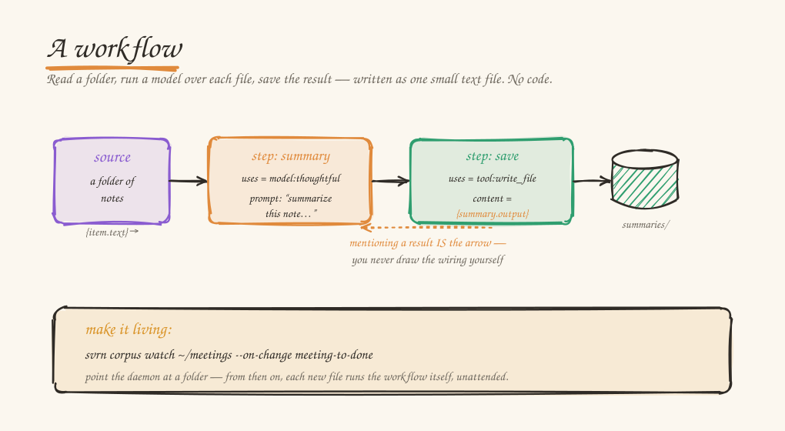

# Write a workflow

Your computer can read a whole folder for you. Point it at two hundred notes, or
a year of meeting transcripts, or every draft in a directory — and have it go
through each one, run a model over it, and hand you back something useful. You
write that as a small text file. No code, no build step, and not one byte leaves
your machine to do it.

That text file is a *workflow*. The same `sovereign` daemon you already run
executes it, using whatever model you have loaded.

<p align="center"></p>

## Start from a starter

A few workflows ship ready to run. List them:

```bash
svrn workflow list
```

The flagship turns a folder of documents into a private, cited notebook you can
chat with — it reads each file (PDF, Office, HTML, Markdown, text), and nothing
leaves your machine:

```bash
svrn workflow run notebook --folder ~/Documents/notes --corpus my-notebook
svrn chat inspect --corpus my-notebook "your question"
```

To make one your own, copy it and edit the text file — it's the same kind of file
this guide is about:

```bash
svrn workflow copy notebook my-recipe
# edit ~/.sovereign/workflows/my-recipe.toml, then:  svrn workflow run my-recipe --folder …
```

The rest of this guide is how those files work, so you can change one or write
your own from scratch.

## The whole thing

Here is a whole workflow — close to the shipped `summarize` starter — that reads
every file in a folder and writes back a one-paragraph summary. It's just text:

```toml
[workflow]
name = "summarize-notes"

[source]
type = "folder"
path = "./notes"
glob = "*.md"

[[step]]
id = "summary"
uses = "model:thoughtful"
prompt = """
Summarize this note in one sentence, then list any action items as bullets.

{item.text}
"""

[[step]]
id = "save"
uses = "tool:write_file"
params = { path = "summaries/{item.stem}.md", content = "{summary.output}" }
```

Run it:

```bash
svrn workflow run summarize.toml
```

Come back to a `summaries/` folder with one Markdown file per note. No API key,
no upload, no per-page bill. That's the whole loop — a `source` to read from, and
`step`s that do the work.

A few things are doing the lifting, and they're the only ideas you need:

- The **source** lists what to run over. `folder` hands each file to the steps as
  `{item}` — `{item.text}` is the file's contents, `{item.stem}` its name without
  the extension.
- A **step** has an `id`, something it `uses`, and inputs. `model:thoughtful` runs
  your local model on a `prompt`. `tool:write_file` saves text to a path.
- Steps wire themselves together by **reference**. `{summary.output}` means "the
  output of the step called `summary`." You never draw the arrows; mentioning a
  result is the arrow. That's also how the daemon knows `save` runs after
  `summary`.

## Now change one line

Because the steps are joined loosely by name, you can repurpose a whole workflow
by swapping a piece. Point the source at a list of web pages instead of a folder,
and add a step that fetches each one:

```toml
[source]
type = "inline"
items = ["https://www.gutenberg.org/files/974/974-0.txt"]

[[step]]
id = "page"
uses = "tool:web_fetch"
params = { url = "{item.path}" }

[[step]]
id = "summary"
uses = "model:thoughtful"
prompt = "Summarize this page in three sentences.\n\n{page.output}"
```

Same summarizer, different input — now it digests the web. The catalogue of steps
isn't a fixed list we shipped: any tool you connect over **MCP** (the open
standard for plugging tools into models) becomes a step the same way, written
`mcp:<server>:<tool>`. Connect a transcription server and `{item.text}` of an
audio file becomes its transcript; connect one that reads PDFs and the same
folder-summary workflow above works on PDFs. You add the capability once; from
then on it's just another step you can name. (A runnable MCP example —
[`notes-digest.toml`](../sovereign/crates/sovereign-workflow/examples/notes-digest.toml)
— ships with the engine.)

## Make it act — off-the-shelf tools

Everything above *reads and writes your own files*. The leap is when a workflow
**acts in your other tools** — and it does that by driving a real MCP server you
already trust, not one we wrote. We build none of the tools; we connect them.

Take the shipped **`meeting-to-done`** workflow. For each transcript in a folder,
your local model writes a brief (recap + an action-item checklist), an MCP server
*writes that brief* where it belongs, and the transcript is filed into a
searchable `meetings` corpus you can ask later. The model never leaves your
machine; the only tool we don't own is the one you plugged in.

Connect an off-the-shelf server — here the official filesystem server, bridged to
HTTP (Sovereign connects to endpoints; it doesn't supervise processes):

```bash
npx -y supergateway --stdio "npx -y @modelcontextprotocol/server-filesystem ~/meetings" \
    --outputTransport streamableHttp --port 8766 &
svrn mcp add fs --url http://localhost:8766/mcp
svrn mcp tools fs            # confirm Sovereign sees its tools

svrn workflow run meeting-to-done --folder ~/meetings/transcripts \
    --param outdir=~/meetings --corpus meetings
svrn chat inspect --corpus meetings "what did we decide about pricing?"
```

The action step is just `uses = "mcp:fs:write_file"`. Swap that one line for a
real task or email server and the same workflow drives those instead —
`mcp:todoist:create_task`, `mcp:gmail:create_draft`, `mcp:linear:create_issue`.
Swap the transcript read for `mcp:whisper:transcribe_audio` and it starts from a
recording. The shape never changes; only the connectors do — and they're the
whole MCP ecosystem, not a list we shipped.

## Make it living — a folder that runs itself

Everything so far is a workflow you *run*. The last turn of the screw is a workflow
that runs *itself*. Point the daemon at a folder and attach a workflow; from then on,
whenever a file lands or changes, the workflow runs — unattended, on your machine, no
command:

```bash
svrn corpus watch ~/meetings/transcripts --on-change meeting-to-done
```

Because a triggered workflow runs without you watching, Sovereign shows what it can do
and asks once before arming it:

```
Arming `shipped:meeting-to-done` to run automatically on every change to this folder.
  It can:
    • write files
    • use your local model
  Run this unattended on every change? [y/N]
```

That's the difference between a tool you reach for and an assistant that's just *there*
— quietly turning each new transcript into a brief, each new PDF into your searchable
notebook, each screenshot into whatever you wired up. The trigger hands the workflow the
folder, the corpus name, and the changed files (`{param.folder}`, `{param.corpus}`,
`{param.changed}`); the rest is the same workflow you already wrote. It runs in the
daemon, so it keeps working after you close the terminal — and, like everything here,
nothing leaves your machine. (Have a workflow write its output *outside* the folder it
watches, or you'll feed its own output back to itself.)

## It all stays on your machine

The model that does the thinking runs on your own computer, over your own files.
Nothing is uploaded, there's no per-task meter, and no account stands between you
and the work — the only time anything leaves is if *you* add a step that reaches
out, like fetching a web page. And when one machine isn't big enough for the model
you want, you can pool a few you trust and run a model none of them could hold
alone (see [Run a model bigger than your machine](./RUN_A_BIGGER_MODEL.md)) — the
workflow doesn't change; it just has a bigger brain behind it.

## A few you can build today

**Make a private, searchable notebook out of a folder.** Read each document,
break it into pieces, turn each piece into a vector, and store them in a searchable
index — then ask questions of it from `svrn chat`. This is real corpus ingest,
written as data:

```toml
[source]
type = "folder"
path = "./documents"
glob = "*.txt"

[[step]]
id = "chunk"
uses = "tool:chunk"
params = { path = "{item.path}" }

[[step]]
id = "embed"
uses = "embed:default"
for_each = "chunk"
input = "{element.text}"

[[step]]
id = "store"
uses = "tool:corpus_store"
params = { corpus = "my-notebook", chunks = "{chunk.output}", embeddings = "{embed.output}", title = "{item.stem}", source_doc_id = "{item.path}" }
```

**Pull a structured field out of every file.** Tell the model to answer in a
shape, and you get back data instead of prose — ready for the next step:

```toml
[[step]]
id = "facts"
uses = "model:fast"
for_each = "chapters"
prompt = "From this text, list the people and places.\n\n{element.text}"
structured_output = { type = "object", properties = { people = { type = "array", items = { type = "string" } }, places = { type = "array", items = { type = "string" } } }, required = ["people"] }
```

More worked examples — corpus ingest, per-chapter extraction, the MCP digest —
live in
[`sovereign/crates/sovereign-workflow/examples/`](../sovereign/crates/sovereign-workflow/examples/).

## The rest of the vocabulary

You've seen most of it. The remainder, briefly:

- **Sources:** `folder` (a glob of files — `glob` accepts a comma list like
  `*.pdf,*.md`), `inline` (`items = [...]`), `list` (a file, one item per line). A
  folder item exposes `{item.path}`, `{item.stem}`, and `{item.text}` (the file's
  text, for text files).
- **Parameters:** `{param.key}` reads a value passed at run time — `--param
  key=value`, or the shorthands `--folder`, `--corpus`, `--glob`. They resolve in
  any field *and* in the source path/glob, so one workflow runs over any folder.
- **Steps:** `model:<class>` (`fast`, `thoughtful`), `embed:default`,
  `transform:json` (reshape data — no model, no tool), `mcp:<server>:<tool>` (any
  connected MCP tool), and `tool:<id>` built-ins — `extract` (a document's text, any
  format), `chunk`, `read_file` / `write_file`, `corpus_store` (build a searchable
  corpus), `corpus_search` (read one back — the top-k items by similarity to a
  query vector, ranked), `read_csv` (a CSV as a collection of row objects),
  `vector_mean` (the weighted centroid of a set of vectors), `web_fetch`, `zip`.
- **`for_each`** runs a step once per element of an earlier collection; inside it,
  `{element}` is the current one. It's how you go from one document to a result
  per chapter. To pair two collections back up by position, there's `tool:zip`.
- **It remembers.** Runs are cached by their inputs, so a re-run skips the work
  whose inputs didn't change — edit one prompt near the end and you don't pay for
  the steps before it again. `--no-cache` forces a clean run; `--concurrency N`
  does more at once.

## Where the edges are

The file describes the *shape* of the work — what to read, what to fan out, which
model and tools to call, where to save. Genuine algorithms (clustering a corpus,
walking a graph) and new capabilities (reading PDFs, transcribing audio) live
behind a named step with real code or an MCP server behind it — like calling a
library function instead of writing it out longhand. If the thing you want doesn't
exist yet, it arrives as one new step, and then anyone can use it.

We rebuilt our own document-enrichment pipeline this way to make sure the line was
honest: the orchestration moved into the file, the algorithms stayed behind their
names, and it produced the same result as the hand-written version.

---

Describe the shape, run the file, keep the results.

*The full step, source, and reference grammar is in the engine's
[`README.md`](../sovereign/crates/sovereign-workflow/README.md); the runnable
examples are right beside it.*
