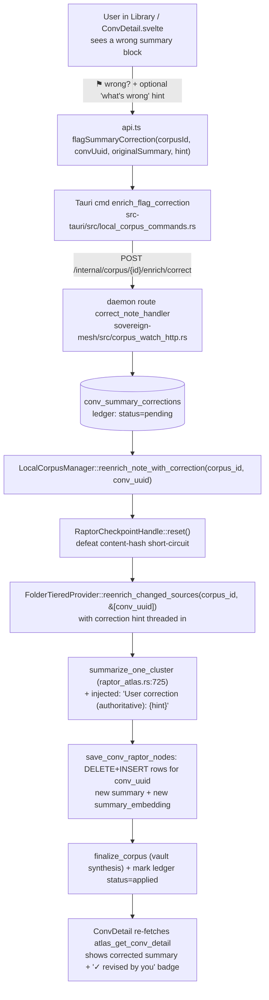

# Summary Revision Loop — flag a wrong RAPTOR summary, guide a durable re-enrich

Status: DRAFT (spec) · Owner: enrichment · Created 2026-07-16

## 1. Why

The power of this system is *verifiability*. The Library is good but not
perfect — RAPTOR clustering and LLM summarization make mistakes. We build with
imperfection as a given and provide tools to **surface** it and **revise** it.
That slow revision — water over a stone — is what turns a generic corpus into
something that feels like the user's own.

Today a user who spots a wrong summary has no recourse short of re-enriching the
entire vault (minutes-to-hours, and it may reproduce the same error). This spec
adds the smallest, most direct loop: **flag the wrong summary → tell the system
what's wrong → it re-enriches just that one note, guided by the correction, and
the correction sticks.**

### The motivating real defect (live data, `obsidian-vault-959ee8a8f330`)

The note `Parable of Yakumo.md` has **two** level-0 RAPTOR cluster nodes that
*disagree with each other*:

- **Node A** — `primary_entities: ["Yakumo","Haruki"]` — *"Haruki receives a book
  from Yakumo that records births, deaths, and weather. Following **Yakumo's
  death** in the spring, Haruki inherits her journal…"* — hallucinates **Yakumo
  (the village/setting) as a person who dies**, and drops the real character.
- **Node B** — `primary_entities: ["Yakumo","Grandmother Sato","Haruki",…]` —
  *"The story follows the **fishing village of Yakumo**… **Grandmother Sato
  observes**…"* — correct.

The clustering split the note and one cluster invented a person out of the
setting. This is exactly the class of error the revision loop targets, and it
tells us the fix unit must be **the whole note** (you cannot safely patch one
cluster while the clustering itself is part of what went wrong).

## 2. Design decisions (locked)

| Decision | Choice | Why |
|---|---|---|
| **Unit of revision** | The **note**, keyed `(corpus_id, conv_uuid)` | `conv_uuid` *is the root-relative file path* (`"Parable of Yakumo.md"`), stable and one-to-one with the note. RAPTOR `node_id`s are fresh `Uuid::new_v4()` on every build and are DELETE+INSERT-replaced (`sovereign-store/src/sqlite/conv_tiered.rs:147-178`), so a node-keyed flag would dangle. The defect spans clusters; the save path replaces all nodes for a `conv_uuid` atomically — so note-level is both correct and free. |
| **Fix mechanism** | **Guided re-enrich** — LLM re-runs the note's RAPTOR with the user's correction injected into the summarization prompt | A blind re-roll at temp 0.2 tends to reproduce the same error; the revision would not converge. The hint makes it corrective. |
| **Durability** | **Durable revision ledger** — corrections persist and re-apply on every future rebuild of the note | Water over stone: a fix that reverts on the next full rebuild (resume-on-restart, content edit) is not a revision. The ledger is also the glassbox audit ("why does this summary read this way? the user corrected it on <date>"). |
| **Direct hand-editing of the summary** | **Out of scope for v1** (Phase 2) | User's framing was "flag → re-enrich." Direct authoring adds a provenance/lock model; defer. |

## 3. The crux the code forced on us

Two facts (verified across `corpus-engine`, `sovereign-tools`,
`sovereign-store`) shape the whole design:

1. **A flag on an unchanged note is a no-op unless we bust the checkpoint.**
   The per-note RAPTOR checkpoint's input hash is computed over
   `sorted chunk-ids + embedding dim` only — **note content is not in the
   hash** (`sovereign-tools/src/raptor_checkpoint.rs:113-122`). When the user
   flags a summary, the note's *content* hasn't changed, so `decide()` returns
   `Resume(completed)` and the cached **wrong** summary is reloaded and
   re-persisted with **no LLM call** (`raptor_atlas.rs:193-202`). The loop
   *must* explicitly invalidate the checkpoint (`RaptorCheckpointHandle::reset`,
   `raptor_checkpoint.rs:175`) before re-enriching.

2. **The RAPTOR checkpoint is a single shared per-corpus slot, not per-note**
   (`<index_dir>/_raptor_checkpoint/manifest.json`; `raptor_checkpoint.rs:102-107`
   never joins `conv_uuid`). Every note overwrites the previous note's manifest,
   so at rest it holds at most one note's checkpoint. Consequence: on a full
   rebuild only the *last* note short-circuits; every other note does a fresh
   LLM build. This is why resume-on-restart re-runs all prior notes' LLM instead
   of being cheap — and it is exactly the deficiency the **skip-already-built**
   work must fix. See §7 (Synergy).

## 4. Architecture & data flow



### Identity chain (no fuzzy matching needed)

`.md` file → `source_doc_id` (root-relative path, set in
`sovereign-tools/src/local_corpus/extract_stage.rs:85-98`) → `conv_uuid`
(they are equal for folder/vault corpora — `corpus-engine/src/enrichment/tiered.rs:8`,
`sovereign-store/src/migrations.rs:751-752`) → `conv_raptor_nodes` rows keyed
`(corpus_id, conv_uuid)`. The `convUuid` already in scope at the UI render site
**is** the `source_doc_id` the engine consumes.

> ⚠️ **Do not repeat the sweeper's bug.** The watched-folder sweeper passes
> file **basenames** to reenrich (`worker.rs:635-642`), which fails to match
> nested notes whose `conv_uuid` is a relative path (`sub/note.md`). The
> correction path must key off the true `conv_uuid` (relative path), which the
> UI already has.

## 5. The revision ledger

New table (add to `run_conv_tiered_migration`, `sovereign-store/src/migrations.rs`):

```sql
CREATE TABLE IF NOT EXISTS conv_summary_corrections (
    corpus_id           TEXT NOT NULL,
    conv_uuid           TEXT NOT NULL,   -- = source_doc_id (root-relative path)
    correction_hint     TEXT NOT NULL,   -- the user's "what's wrong" note (authoritative guidance)
    original_summary    TEXT,            -- the wrong summary the user was looking at (context for the LLM + audit)
    flagged_node_id     TEXT,            -- which RAPTOR node they flagged (context only; NOT a stable key)
    status              TEXT NOT NULL,   -- 'pending' | 'applied' | 'review' | 'dismissed'
    created_at          INTEGER NOT NULL,
    applied_at          INTEGER,
    content_hash_at_flag TEXT,           -- the note's input_hash when flagged; detect later content drift
    PRIMARY KEY (corpus_id, conv_uuid)   -- one active correction per note (re-flag supersedes)
);
CREATE INDEX IF NOT EXISTS idx_conv_corrections_status
    ON conv_summary_corrections (corpus_id, status);
```

**States**

- `pending` — user flagged; not yet re-enriched. The runner and the targeted
  path both treat pending as "force rebuild this note + inject the hint."
- `applied` — the guided re-enrich completed; the corrected rows are persisted.
  The hint is **kept** and re-injected on any *future* rebuild of this note so
  the correction never silently reverts.
- `review` — set when the note's content later changes materially
  (`input_hash != content_hash_at_flag`). The correction is still applied
  (the user's factual statement usually still holds), but the UI surfaces
  "your correction may be stale — the note changed" so they can confirm or
  update it.
- `dismissed` — user retracted the correction (or accepted the machine
  summary). No longer injected.

**One active correction per note** (PK on `(corpus_id, conv_uuid)`). Re-flagging
supersedes — the loop is iterative; the user refines the hint over successive
passes until the summary is right. (History, if we want it later, is a separate
append-only audit table; v1 keeps live state only, matching the work-atlas
"live state, not a log" philosophy.)

## 6. Backend changes (enumerated, anchored)

1. **Migration** — add `conv_summary_corrections` (§5) to
   `run_conv_tiered_migration` (`sovereign-store/src/migrations.rs:~687-732`
   neighborhood). Store CRUD methods on the sqlite store next to
   `save_conv_raptor_nodes` (`sovereign-store/src/sqlite/conv_tiered.rs`):
   `upsert_summary_correction`, `get_active_correction(corpus_id, conv_uuid)`,
   `list_corrections(corpus_id, status?)`, `set_correction_status`.

2. **Thread the hint into summarization.** `summarize_one_cluster`
   (`sovereign-tools/src/raptor_atlas.rs:725-736`) builds the prompt inline.
   Add an optional `correction_hint: Option<&str>` to the summarization input
   struct (`ClusterSummarizationInput`, `raptor_atlas.rs:646-651`) and, when
   present, append a high-priority block to the prompt:
   *"A user has reviewed a previous summary of this material and provided an
   authoritative correction. Honor it precisely: {hint}"*. Thread it from
   `enrich_conversation` (which knows `conv_uuid`) down through
   `build_folder_artifacts` → `build_atlas_artifacts_with_checkpoint` →
   `build_raptor_atlas_impl` → `summarize_clusters_buffered_with_checkpoint`.
   Keep the grammar-constrained `{"summary","primary_entities"}` output
   (`raptor_atlas.rs:743-751`) unchanged.

3. **Correction-aware, force-capable re-enrich.** `enrich_conversation`
   (`sovereign-tools/src/conv_tiered_provider.rs:1081`) looks up
   `get_active_correction(corpus_id, conv_uuid)` before building. If a
   correction is `pending`/`applied`/`review`, it (a) passes the hint into
   summarization (item 2), and (b) for `pending`, forces a fresh build by
   resetting the checkpoint. Add a `force_rebuild: bool` to
   `reenrich_changed_sources` (`conv_tiered_provider.rs:816`) that calls
   `RaptorCheckpointHandle::reset()` (`raptor_checkpoint.rs:175`) before
   `enrich_conversation` for the targeted docs. On success, flip the ledger row
   `pending → applied` (stamp `applied_at`).

   > This makes corrections durable **through every rebuild path** — targeted
   > flag, watched-folder sweep, resume-on-restart, and full re-enrich — because
   > the lookup lives in `enrich_conversation`, not just the flag entry point.

4. **Manager entry point.** Add
   `LocalCorpusManager::reenrich_note_with_correction(corpus_id, conv_uuid, hint, original_summary, flagged_node_id)`
   (mirror the shape of `reset_enrichment_state`/`enrich_now`,
   `manager.rs:874/961`). It upserts the ledger row (`pending`), then reaches
   `deps.tiered_provider` (set via `set_tiered_deps`, `manager.rs:394`) and calls
   `reenrich_sources(corpus_id, &[conv_uuid])` with force. Serialized by the
   existing single-permit enrichment driver — a flag during a running full build
   **queues** (acceptable for v1; preemption is Phase 2).

5. **The three thin transport layers** (model on the existing
   `lc_enrich_now` → `/internal/corpus/enrich-once` path):
   - **Daemon route** `POST /internal/corpus/{id}/enrich/correct` with body
     `{ conv_uuid, correction_hint, original_summary, flagged_node_id }` →
     `correct_note_handler`, next to `reset_enrichment_state`
     (`sovereign-mesh/src/corpus_watch_http.rs:1306`). Plus
     `GET /internal/corpus/{id}/enrich/corrections` (list, for the review view).
   - **Tauri command** `enrich_flag_correction` in
     `src-tauri/src/local_corpus_commands.rs` (POSTs the route, like
     `lc_enrich_now` at `:708`). Plus `enrich_list_corrections`.
   - **api.ts** `flagSummaryCorrection(...)` + `listSummaryCorrections(corpusId)`
     (`invoke(...)`, like `lcEnrichNow` at `api.ts:876`).

## 7. Synergy with skip-already-built (the shared per-note gate)

Both features are the same decision with opposite polarity — **"should I
rebuild this note?"** — and both need it in the same place: the runner loop
(`run_folder_tiered_enrichment`, `corpus-engine/src/enrichment/tiered.rs:536-583`),
which today rebuilds **every** note with no `state`/hash check.

Introduce one gate, consulted by the runner and by the targeted path:

```
decide_note(corpus_id, conv_uuid, current_input_hash) -> Build | Skip
  if ledger.status == pending                      -> Build (force + inject hint)   // flag feature
  if ledger.status in {applied, review}
       and state == Ready
       and current_input_hash == last_built_hash   -> Skip  (corrected rows stand)
  if state == Ready and current_input_hash == last_built_hash and no ledger
                                                   -> Skip  (skip-already-built)     // resume perf
  else                                             -> Build (+ inject hint if any)
```

This requires a **per-note** `last_built_hash` (the current checkpoint is a
single shared slot — §3.2 — so it can't answer "was *this* note built?").
Two ways to get it, in order of cleanliness:

- **(Recommended) Make the RAPTOR checkpoint per-note** — key the dir by
  `conv_uuid` (`_raptor_checkpoint/<hash(conv_uuid)>/manifest.json`,
  `raptor_checkpoint.rs:102-107`). This fixes the shared-slot bug, gives real
  per-note resumability (cheap resume), and the targeted reset naturally scopes
  to one note.
- **(Lighter) Store `input_hash` on `conv_skeletons`** (new column) at each
  successful build; the runner compares it. Leaves the checkpoint as-is.

The correction feature only strictly needs item 3's `force` reset. But building
it on the per-note gate means **skip-already-built falls out for free** and the
morning's resume stops re-running all prior LLM work. Recommend landing the
per-note checkpoint as the foundation, then this feature and skip-already-built
are two thin consumers of it.

## 8. Frontend changes

- **Flag affordance** — a subtle control in the per-node header of the summary
  card (`ConvDetail.svelte:251-264`, next to level/coherence). It captures the
  specific `node.summary` the user judged wrong (→ `original_summary`) and its
  `node_id` (→ `flagged_node_id`, context only) even though the rebuild is
  note-wide. `corpusId`/`convUuid` are already in scope (`ConvDetail.svelte:29`).
- **"What's wrong?" input** — a lightweight inline textarea (optional but
  encouraged) → `correction_hint`. Copy: *"What did it get wrong? (e.g. 'Yakumo
  is the village; Grandmother Sato is the character')."*
- **Correcting state** — reuse the enrichment progress surface scoped to the
  note; poll `atlas_get_conv_detail` until the summary text changes / ledger
  flips to `applied`. Expect ~1 min (one note's RAPTOR on the local model).
- **Provenance badge (glassbox)** — a note/summary with an `applied` correction
  shows `✓ revised by you · <date>`; a `review` correction shows a subtle
  "correction may be stale — the note changed" affordance to re-confirm. This is
  the visible water-over-stone: the user *sees* which parts of their library
  they have shaped.
- **Corrections view** (small) — reuse the `ConflictsPanel.svelte` review-list
  shape (mounted from `NotebookDetail.svelte:560`) to list a notebook's
  corrections (pending/applied/review) with re-flag / dismiss. Mirror the
  TEACHABLE `saveLesson`/`listLessons`/`deleteLesson` write-back shape
  (`api.ts:349-377`).

## 9. Retrieval propagation (verify during build)

RAPTOR summaries feed grounding (`apply_raptor_grounding`) via
`summary_embedding` on `conv_raptor_nodes`, optionally through a derived
`raptor_summaries.lance` ANN index with a brute-force `conv_raptor_nodes`
cosine scan as fallback (SYSTEM_OVERVIEW §Enrichment).

- The guided re-enrich re-runs `save_conv_raptor_nodes`, which DELETE+INSERTs
  the note's rows **with fresh `summary_embedding`** — so if grounding uses the
  brute-force `conv_raptor_nodes` scan (the desktop-tiered default when no lance
  index was built), **the correction propagates to retrieval automatically**.
- **Verify:** does this vault have a `raptor_summaries.lance`? If yes, its entry
  for the note is stale until rebuilt — either invalidate its freshness gate
  (so retrieval falls back to the brute-force scan) or refresh the single
  vector after a targeted re-enrich. Confirm before shipping; do not assume.

## 10. Edge cases & invariants

- **`conv_uuid` = relative path** — key everything on it; never on `node_id`
  (regenerated per build) or basename (breaks nested notes).
- **Rename/move a note** changes its relative path → new `conv_uuid`,
  orphaning old rows *and* the correction. Acceptable v1; note it. (A future
  rename-follow could re-key the ledger.)
- **Content changes after a correction** → runner sets ledger `review`, keeps
  applying the hint, UI surfaces staleness.
- **Concurrency** — the single-permit driver serializes; a flag during a full
  build queues. Log the queue position (glassbox).
- **Empty note / deletion** — `reenrich_changed_sources` already treats an empty
  chunk set as deletion and wipes rows (`conv_tiered_provider.rs:864-872`); a
  correction on a since-deleted note should no-op and `dismiss` the ledger row.
- **INVARIANT (existing):** the runner owns the terminal state stamp; the
  per-note provider must not stamp `_enrichment_state.json` terminal. The
  targeted re-enrich runs through `reenrich_changed_sources`, which already
  stamps its own run-level terminal (`conv_tiered_provider.rs:913`). Keep it
  that way (see the folder-tiered-runner-owns-terminal invariant).

## 11. Observability (glassbox)

- `tracing` span per correction: `corpus_id`, `conv_uuid`, hint length,
  checkpoint-reset taken, cluster count re-summarized, LLM ms, before/after
  summary hashes.
- The ledger itself is the audit surface: "why does this summary read this way?"
  → `get_active_correction` shows the hint + date + original.
- Emit a structured event on `pending → applied` so a future progress drawer can
  narrate "revised *Parable of Yakumo* per your correction (2 clusters, 48s)."

## 12. Phasing

- **Phase 1 (this spec)** — ledger + guided targeted re-enrich (checkpoint reset
  + hint injection) + the 3 transport layers + flag UI + provenance badge.
  Durable via the `enrich_conversation` ledger lookup.
- **Phase 2** — per-note checkpoint + skip-already-built gate (§7) as the shared
  foundation; corrections review panel; direct hand-edit mode (human-authored
  summary, locked from overwrite, re-embedded); priority preemption of a running
  full build; rename-follow for the ledger.

## 13. Testing (end-to-end, per project principle)

- **Unit** — ledger CRUD; `decide_note` truth table (§7); prompt-injection
  string built when hint present/absent.
- **Provider** — `reenrich_changed_sources(force=true)` on an unchanged note
  actually resets the checkpoint and produces a *different* summary (assert the
  LLM ran: node `created_at` advanced, `node_id`s changed, row count sane).
- **Durability** — flag a note (`applied`), then trigger a full re-enrich /
  resume; assert the corrected summary survives (hint re-injected, not reverted).
- **e2e (Playwright, mocked Tauri per the desktop harness)** — render a note in
  `ConvDetail`, click flag, enter a hint, submit; assert the correcting state,
  then the updated `atlas_get_conv_detail` payload and the `✓ revised by you`
  badge. Reuse the desktop chat Playwright mocked-Tauri pattern.
- **Definition of done** — `lint_status` + `test_status` both `fresh_passing`
  across the workspace; `npm run check` + `npm run test` green for the desktop
  crate.

## 14. Open items to verify before/while building

1. **Retrieval propagation** (§9) — presence of `raptor_summaries.lance` for
   desktop-tiered vaults; refresh vs brute-force fallback.
2. **Hint threading depth** — confirm `summarize_one_cluster` can receive the
   note-level hint without disturbing the RAPTOR recursion's child-summary
   re-summarization at higher levels (the hint should apply at every level of
   the note's tree).
3. **Per-note checkpoint** (§7) — decide recommended (per-note dir) vs lighter
   (`conv_skeletons.input_hash` column) for the shared gate; both unblock
   skip-already-built.
