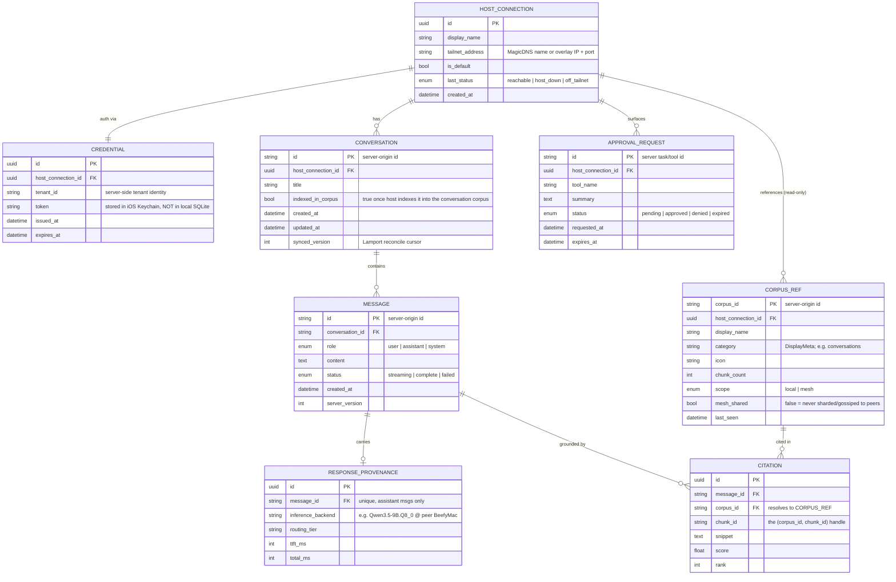

# Sovereign Mobile Client (iOS) — v1 Data Model & Acceptance Criteria

## Scope

v1 is a **thin presentation + control client** for a Sovereign host. It runs
**no local inference, no embedding, and no Runtime** — it sends queries to a
host node's `sovereign-server`, which runs routing/planning/retrieval/synthesis
node-side, and the phone renders the streamed result. It reaches the host
**only over the tailnet** and authenticates as a tenant. The phone is a
**client, not a mesh peer** (no gossip, no shard serving, no `cwth-` key).

A conversation is **two things** here: (1) live chat state in the host's
StateStore, which the phone caches for display, and (2) once indexed, a
host-side **conversation corpus** (the `conversations-*` recipe +
`conversation_atlas` tiered pipeline) that is retrievable like any other corpus.
The phone models the first directly and references the second as a `CORPUS_REF`.

This document defines (1) the client-side data model and (2) the acceptance
criteria for the v1 milestone: an iOS device receiving inference from a host
node and leveraging a corpus installed on that host.

## Data model (ERD)

### Legend — what the phone owns vs mirrors

- **Client-owned (source of truth on device):** `HOST_CONNECTION`,
  `CREDENTIAL`. The only records the phone authors. The token lives in the iOS
  Keychain; the connection record in local SQLite/Core Data.
- **Cached projections of host state (server is source of truth):**
  `CONVERSATION`, `MESSAGE`, `RESPONSE_PROVENANCE`, `CITATION`, `CORPUS_REF`,
  `APPROVAL_REQUEST`. Keyed by **server-origin IDs**, reconciled via
  `synced_version` / `server_version`, safe to evict and re-fetch. The phone
  never originates these — it renders them.
- **Absent from the device entirely:** model weights, embeddings, corpus
  chunks/vectors. `CORPUS_REF` is metadata only; the corpus itself lives on the
  host.

### Notes

- **`CITATION -> CORPUS_REF`** is the data-model encoding of "leveraging an
  installed corpus." A citation carries the host's `(corpus_id, chunk_id)`
  handle and resolves to a `CORPUS_REF` for the same host — making corpus
  usage a verifiable, displayable fact rather than an assumption.
- **Conversation as corpus.** Once the host indexes a conversation (via the
  `conversations-*` recipe + `conversation_atlas` tiered enrichment), it becomes
  a `source_doc` inside a single per-identity conversation `CORPUS_REF`,
  re-indexed incrementally as it grows. `CONVERSATION.indexed_in_corpus` reflects
  this; citations into the conversation corpus are ordinary `CITATION` rows. The
  phone neither builds nor stores this corpus — it only references it.
- **Long-context management is host-side.** Compaction and embedding-based
  retrieval over conversation history run on the host (Runtime + embed slot).
  The phone sends only the new turn + conversation id and never re-uploads full
  history or embeds anything. Assumes a host API that is stateful over a
  conversation id (see Open decisions).
- **Privacy posture is visible.** `CORPUS_REF.scope` / `mesh_shared` let the UI
  badge a source as private-to-this-host. The conversation corpus is always
  `scope=local`, `mesh_shared=false`.
- **`APPROVAL_REQUEST`** is modeled for the control surface discussed during
  design, but is **not required** for the v1 inference+corpus milestone.

---

## Acceptance criteria

### Primary scenario (the milestone)

> **Given** a physical iOS device on the same tailnet as a host node running
> `sovereign-server`, with at least one corpus installed on the host, and the
> device paired to that host with a valid tenant token,
> **When** the user sends a query whose answer depends on the installed corpus,
> **Then** the device receives a host-synthesized streamed response that is
> grounded in that corpus (citations resolve to `(corpus_id, chunk_id)` in it)
> and shows provenance for the serving model/node — with **no** inference or
> embedding performed on the device.

### Must-pass checks

1. **Tailnet-only reachability.** The device reaches `sovereign-server` solely
   over the tailnet interface; there is no public route. Off-tailnet, the
   connection fails closed — no alternate path is attempted.
2. **Authenticated.** The device authenticates as a tenant using the token from
   the Keychain; a request without a valid token is rejected by the host.
3. **Inference is remote and streamed.** The completion arrives token-by-token
   over WS/SSE from the host; the assistant message renders live and persists on
   completion. No model weights or inference runtime are present in the app
   bundle (verifiable by inspecting the `.ipa`).
4. **Corpus is demonstrably used.** The answer contains >= 1 citation whose
   `corpus_id` matches a `CORPUS_REF` for the connected host and whose
   `chunk_id` resolves to a chunk in the installed corpus. Opening a citation
   displays its snippet.
   - *Rigorous form:* install a corpus containing a **distinctive fact absent
     from the model's parametric knowledge**; a correct answer that carries a
     citation to that corpus proves retrieval, not recall.
5. **Provenance is shown.** `RESPONSE_PROVENANCE.inference_backend` is displayed
   (model + serving node, e.g. "... @ peer BeefyMac"), confirming the work ran on
   the host/mesh, not the device.
6. **Busy host is legible.** A `503 + Retry-After` from the host surfaces as
   "host busy," never an error or a hang.
7. **Conversation corpus stays private.** The host's conversation corpus is
   `scope=local` with `mesh_shared=false`: it never appears in mesh shard
   distribution or knowledge fan-out, is never gossiped, and a *different* tenant
   on the same host cannot retrieve it. The phone surfaces `scope`/`mesh_shared`
   so a private-to-this-host source is visibly marked.

### Supporting criteria

8. **Long conversations are host-managed.** The device sends new turns by
   conversation id and does not re-upload full history or perform
   compaction/embedding; context management (history compaction + retrieval over
   prior turns) is verified to occur host-side. A conversation longer than the
   model's context window still answers coherently.
9. **Three distinct connectivity states.** Off-tailnet, on-tailnet-but-host-down,
   and host-busy are each surfaced as separate, user-actionable states — not one
   generic "can't connect."
10. **Offline read, not offline search.** With the host unreachable, previously
    synced conversations/messages remain readable read-only from cache; the app
    does not block or error on launch. Semantic search over conversations is
    *unavailable* offline (it requires the host's embed + corpus) and is failed
    gracefully, not faked.
11. **Cache survives restart.** Conversations/messages render instantly from
    local cache on relaunch, then reconcile against the host.

### Out of scope for this milestone (invariants to preserve)

- No on-device inference, embedding, or Runtime.
- No on-device corpus data (chunks/vectors) — `CORPUS_REF` metadata only.
- The phone is **not** a mesh peer: no gossip, no shard serving, no mDNS
  advertisement, no `cwth-` join key.
- The conversation corpus is **never** gossiped or sharded to peers
  (`mesh_shared=false`) and is tenant-isolated on the host.
- Tool approvals (`APPROVAL_REQUEST`) and multi-host switching may ship later;
  they do not gate this milestone.

### Open decisions (resolve before build)

- **Stateful vs stateless host API.** Confirm `sovereign-server` is stateful
  over a conversation id (preferred — phone sends minimal payload, host owns
  context) vs a stateless OpenAI-style endpoint requiring full-array resend.
- **Privacy boundary for conversations.** Identity-scoped (one user's
  conversations shared across their desktop + phone, private to them) vs
  device-pairing-siloed (separate per device). Default recommendation:
  identity-scoped, with the pairing as the auth, to preserve cross-device
  continuity.

### Build / distribution

The milestone is validated on a **physical iOS device** (not the simulator),
installed via **internal TestFlight** (or development provisioning) — no
external Beta App Review required at this stage, consistent with the
distribution plan.