# UAP Corpus — Entity-Relationship Model

**Purpose.** Data model for the `uap-blue-book` demo corpus + disposition-classification bench. Hand this to the engineers implementing the recipe. It is a contract in the same sense as the rest of the docs: keep it in sync with the recipe in the same PR.

**Scope.** Most of what's below lands on substrate that already exists (asset store, atom graph, LanceDB chunks, tiered enrichment, reconciliation primitive, eval split harness). The genuinely _new_ pieces are the recipe's entity/relationship declarations, the salience ranker, the disposition taxonomy + era-aware label map, and the `uap` bench surface. The [landing map](#landing-map--new-vs-reuse) at the bottom calls out which is which.

---

## ER diagram

```mermaid
erDiagram
    CASE ||--o{ SIGHTING : "has"
    CASE ||--|{ SOURCE_ASSET : "derived_from"
    CASE ||--|| ADJUDICATION : "officially_resolved_as"
    CASE ||--o| GOLD_LABEL : "labeled_for_eval"
    CASE ||--o{ PREDICTION : "predicted_in"
    CASE }o--o{ INVESTIGATING_BODY : "investigated_by"

    SIGHTING ||--|{ OBSERVED_OBJECT : "involves"
    SIGHTING }o--o{ WITNESS : "observed_by"
    SIGHTING }o--o{ INSTALLATION : "occurred_near"
    SIGHTING ||--o| WEATHER_CONTEXT : "under_conditions"

    SOURCE_ASSET ||--|{ CHUNK : "chunked_into"
    EVAL_RUN ||--|{ PREDICTION : "contains"

    INSTALLATION |o--o{ INSTALLATION : "reconciled_into"
    INVESTIGATING_BODY |o--o{ INVESTIGATING_BODY : "reconciled_into"

    CASE {
        string case_id PK
        enum study "SIGN/GRUDGE/BLUE_BOOK/RG615/AARO"
        string record_group "RG341, RG615"
        date date_filed
        string location_text
        float lat "geocoded, nullable"
        float lon "geocoded, nullable"
        bool is_unidentified "derived from ADJUDICATION"
        float salience_score
        enum tier "T1/T2/T3"
        bool in_eval_split
        string source_doc_id FK "join to CHUNK + freshness sidecar"
    }
    SIGHTING {
        string sighting_id PK
        string case_id FK
        datetime occurred_at
        enum time_of_day "DAY/NIGHT/DAWN_DUSK"
        int duration_seconds "nullable"
        int num_witnesses
        enum detection_method "VISUAL/RADAR/VISUAL_RADAR/PHOTO/INSTRUMENT"
    }
    OBSERVED_OBJECT {
        string object_id PK
        string sighting_id FK
        enum shape "DISC/CIGAR/LIGHT/TRIANGLE/SPHERE/FORMATION/OTHER"
        string color
        int count
        enum motion "HOVER/ERRATIC/HIGH_SPEED/STEADY/FORMATION/DESCENDING"
        enum sound "SILENT/HUM/ROAR/NOT_REPORTED"
        string size_estimate
    }
    WITNESS {
        string witness_id PK
        string witness_ref "anonymized; NARA redacts names"
        enum category "MILITARY/CIVILIAN/PILOT/RADAR_OP/LAW_ENF/SCIENTIST"
        enum reliability "HIGH/MEDIUM/LOW/UNRATED"
        string canonical_id FK "reconciliation; weak here, see notes"
    }
    INSTALLATION {
        string installation_id PK
        string name
        enum branch "USAF/USN/ARMY/NASA/OTHER"
        enum type "AIRBASE/RADAR_SITE/MISSILE/TEST_RANGE/OTHER"
        float lat
        float lon
        string canonical_id FK "primary reconciliation target"
    }
    INVESTIGATING_BODY {
        string body_id PK
        string name "OSI, ATIC, project staff"
        enum kind "OFFICE/OFFICER/AGENCY"
        string canonical_id FK
    }
    ADJUDICATION {
        string adjudication_id PK
        string case_id FK
        enum category "disposition taxonomy"
        string subcategory "Venus, weather balloon, Starlink"
        string rationale_text
        enum origin_agency "USAF_BLUEBOOK/AARO"
    }
    WEATHER_CONTEXT {
        string context_id PK
        string sighting_id FK
        string visibility
        string cloud_cover
        string celestial_present "Venus prominent, full moon"
        bool temp_inversion "nullable"
    }
    SOURCE_ASSET {
        string sha256 PK
        string case_id FK
        enum media_type "PDF_SCAN/PDF_BORN_DIGITAL/JSON_META/IMAGE/VIDEO"
        enum source "NARA/BLACK_VAULT/AARO/AWS_ODR"
        int page_count
        float ocr_confidence "null for born-digital"
        int freshness_unix
        int ledger_offset "append-only LedgerEntry ref"
    }
    CHUNK {
        string chunk_id PK "with corpus_id = citation handle"
        string corpus_id PK
        string sha256 FK
        string source_doc_id
        enum tier "T1/T2/T3"
        vector embedding "768d, qwen3-embedding-0.6b"
    }
    GOLD_LABEL {
        string case_id PK
        enum official_category
        enum split "TRAIN/TEST"
        enum label_source "FINDING_AID/MANUAL/AARO_REPORT"
        datetime frozen_at
    }
    EVAL_RUN {
        string run_id PK
        enum policy "BASELINE/TUNED"
        string model_id
        enum split "TRAIN/TEST"
        float accuracy
        float macro_f1
        json confusion_matrix
        datetime created_at
    }
    PREDICTION {
        string prediction_id PK
        string run_id FK
        string case_id FK
        enum predicted_category
        enum gold_category "denormalized for scoring"
        bool correct
        string model_attribution "from ResponseProvenance"
    }
```



---

## Entity → atom-graph mapping

The conceptual entities above land on the existing atom primitives (`atoms.json` SCHEMA_VERSION 2.2 + `asset_atoms.jsonl` / `asset_edges.jsonl`). This column is what the investigation pipeline's `[[enrichment.entity_types]]` should target.

|Entity|Atom kind|Persistence|
|---|---|---|
|`CASE`|`Entity` (kind=Case)|atoms.json; the root node per archival unit|
|`SIGHTING`|`Event`|atoms.json|
|`OBSERVED_OBJECT`|`Entity` (kind=Object), or `Configuration` if you prefer a typed descriptor bundle|atoms.json|
|`WITNESS`|`Entity` (kind=Person)|atoms.json; PII-scanned (`pii.rs`)|
|`INSTALLATION`|`Entity` (kind=Facility)|atoms.json; reconciliation target|
|`INVESTIGATING_BODY`|`Entity` (kind=Org/Person)|atoms.json|
|`ADJUDICATION`|`Claim`|atoms.json; the official ruling, eval target|
|`WEATHER_CONTEXT`|`Entity` (kind=Context) or attributes on `SIGHTING`|atoms.json|
|`SOURCE_ASSET`|`Asset` (AD-2 envelope)|`asset_atoms.jsonl` + `assets/` ledger (AD-1)|
|`CHUNK`|— (not an atom)|`chunks.lance`; atoms reference it via `source_doc_id` / `ChunkRef`|
|`GOLD_LABEL`, `EVAL_RUN`, `PREDICTION`|— (not atoms)|eval store (see [Eval & gold schema](#eval--gold-schema))|

**Provenance.** Every extracted atom carries a `source_doc_id` (`ChunkRef`) so it joins back to the `CHUNK` it was extracted from and inherits freshness. This is the citation handle; do not invent a parallel one.

---

## Entity notes

- **CASE** — the archival unit (a Blue Book/Sign/Grudge case file, or an RG 615 / AARO record). One case usually corresponds to one sighting event, but not always; see open decision #1. `is_unidentified`, `salience_score`, `tier`, `in_eval_split` are derived, not extracted — populated by the salience ranker and the adjudication, not the LLM.
- **SIGHTING** — the observed _event_. Object/weather/observation attributes hang off the event, not the file, which is the main reason CASE and SIGHTING are separated.
- **OBSERVED_OBJECT** — the structured "what was seen." These attributes are the primary _features_ the disposition classifier reads. Most are extractable by GLiNER on the cold tail (shape, color, count) without the 35B.
- **WITNESS** — largely de-identified: NARA's Blue Book release excludes the names of people involved in sightings. Model the _role_ and _reliability_, not the identity.
- **INSTALLATION / INVESTIGATING_BODY** — the productive reconciliation targets (see [Reconciliation scope](#reconciliation-scope)).
- **ADJUDICATION** — the official disposition, modeled as a first-class node rather than a CASE attribute so the official label (`GOLD_LABEL` derives from it) and the model's output (`PREDICTION`) sit symmetrically for the eval. Open decision #2.
- **SOURCE_ASSET** — content-addressed; raw bytes + optional parsed-form cache + ledger entry already provided by the asset store. `ocr_confidence` is null for born-digital (RG 615 / AARO) and populated (often low) for scanned Blue Book microfilm.

---

## Relationships

Domain relationships are declared in the recipe's `[[relationship_types]]` and materialize as typed edges. Only `Attaches` (asset → atom) is a built-in `EdgeType` today; the rest are recipe-declared and need an edge variant or the investigation pipeline's grammar-emitted edges.

|Relationship|Cardinality|Edge|Notes|
|---|---|---|---|
|`CASE has SIGHTING`|1 : 0..N|recipe-declared|collapses to 1:1 for single-event cases (#1)|
|`CASE derived_from SOURCE_ASSET`|1 : 1..N|**`Attaches` (built-in)**|the asset-store linkage|
|`CASE officially_resolved_as ADJUDICATION`|1 : 1|recipe-declared|the gold ruling|
|`SIGHTING involves OBSERVED_OBJECT`|1 : 1..N|recipe-declared|features for the classifier|
|`SIGHTING observed_by WITNESS`|M : N|recipe-declared|witnesses mostly anonymous|
|`SIGHTING occurred_near INSTALLATION`|M : N|recipe-declared|drives the hotspot/threshold detector|
|`SIGHTING under_conditions WEATHER_CONTEXT`|1 : 0..1|recipe-declared|astronomical/inversion explanations|
|`CASE investigated_by INVESTIGATING_BODY`|M : N|recipe-declared|OSI / ATIC / project staff|
|`SOURCE_ASSET chunked_into CHUNK`|1 : 1..N|n/a (storage)|LanceDB|
|`*entity* reconciled_into *entity*`|0..1 : 0..N|reconciliation oplog|`canonical_id`; facilities/bodies only|

`[[patterns]]`: ship one `threshold` detector — "installations with > N sightings within R km" — framed as descriptive geography (this is what AARO's own hotspot maps do). Do **not** ship `circular_flow` / `role_overlap` pointed at sightings; on this data they manufacture apophenia and invite the wrong kind of attention.

---

## Disposition taxonomy

The `category` enum is the classifier's label set and the confusion-matrix axis. It unifies Blue Book's historical categories with AARO's modern ones:

```
ASTRONOMICAL       meteor, fireball, planet/star (Venus is the classic)
AIRCRAFT           conventional / military / commercial
BALLOON            weather, research, party
SATELLITE          incl. Starlink                       [post-1957; Starlink post-2019]
UAS_DRONE          uncrewed aircraft                     [meaningfully post-2010s]
BIRD               wildlife
ATMOSPHERIC        clouds, temperature inversion, mirage, ball lightning
SENSOR_ARTIFACT    radar anomaly, lens flare, compression artifact  [modern sensor era]
HOAX               hoax / psychological
OTHER_IDENTIFIED   identified, none of the above
INSUFFICIENT_DATA  could not be analyzed
UNIDENTIFIED       Blue Book's "unidentified" (701); AARO's "true anomaly"
```

**Era handling (decide before training — open decision #3).** `SATELLITE`, `UAS_DRONE`, and `SENSOR_ARTIFACT` are anachronistic for the 1947–69 Blue Book era. Recommended: a **date-conditioned label mask** so the model cannot predict "Starlink" for a 1952 case, and so the confusion matrix is read against the categories that were _possible_ at the time. The alternative (one superset with era-validity flags) keeps a single label space but makes the matrix harder to interpret. The Blue Book ↔ AARO split in the data makes this a real modeling axis, not a nicety.

---

## Eval & gold schema

Mirrors the Enron eval discipline (frozen splits + peek budget), but the task is **classification against the official disposition**, not entity-resolution against identity.

- **`GOLD_LABEL`** — the frozen answer key, one per eval-set CASE. `official_category` comes from `label_source`: the finding-aid/index where present (cheap, no OCR), manual curation for ambiguous cases, or the AARO report for modern records.
- **Splits** — `TRAIN` / `TEST`, frozen at `frozen_at`. Reuse the existing split + peek- budget harness; do not let the tuning loop see `TEST`.
- **`EVAL_RUN`** — one bench run. `policy = BASELINE | TUNED` (e.g., raw narrative vs. narrative + extracted features + era mask). Stores `accuracy`, `macro_f1`, and the full `confusion_matrix` blob.
- **`PREDICTION`** — per-(run, case) model output, with `gold_category` denormalized for scoring and `model_attribution` carried from `ResponseProvenance` (so peer-served predictions are traceable on the mesh).

CLI surface, parallel to `sovereign bench enron`:

```
sovereign bench uap run     --corpus uap-blue-book --split train --policy {baseline|tuned}
sovereign bench uap diagnose --corpus uap-blue-book --split train --policy tuned
```

`diagnose` is the glass-box: the confusion matrix + per-category precision/recall + the worst over-confused pairs (expect night-time ASTRONOMICAL↔AIRCRAFT, and in the modern slice SATELLITE/Starlink misreads — the same confusions human investigators make).

---

## Salience & tiering

The fields on `CASE` that drive the tiered build (the `pageview_rank` analog). The ranker is **new**; the consumers (tiered promotion, freshness) exist.

|Field|Source|Meaning|
|---|---|---|
|`in_eval_split`|`GOLD_LABEL`|required deep — the classifier reads its features|
|`is_unidentified`|`ADJUDICATION.category == UNIDENTIFIED`|the 701; spine of the epistemic showcase|
|`is_notable`|curated list (data file in recipe dir)|the ~100–200 cases people query|
|`is_fresh`|`freshness.rs` (RG 615 / AARO)|newest declassified; fresh-first, near-free|
|`salience_score`|composite of the above|feeds tiered promotion criterion|
|`tier`|promotion result|T1 = embedded only; T2/T3 = deep atlas|

Cold tail → T1 (searchable from metadata). Hot set (~1.5k cases) → T3 deep atlas. This is the scoping that fits the 48-hour build.

---

## Reconciliation scope

The multi-origin reconciliation primitive ports here — **but to facilities and bodies, not people.** In Enron, names drove the merges (and the over-merge bug that chained Lay + Skilling + Fastow). Here, NARA redacts witness names, so `WITNESS` reconciliation has almost nothing to bite on; expect low recall and don't over-invest.

`INSTALLATION` and `INVESTIGATING_BODY` are where it earns its keep, and they're a clean analog to the corporate-suffix normalization that lifted Enron recall (El Paso / El Paso Corp. / El Paso Corporation). The facility equivalent: fold "Wright-Patterson AFB" / "Wright-Patterson" / "WPAFB" / "Patterson Field" via AFB ↔ "Air Force Base" ↔ acronym normalization, while keeping distinct bases apart. Use the same identity-grade signals (exact name fold, acronym/alias) and keep the fuzzy paths off, per the primitive's design. Write merges to the reversible `reconciliation_oplog.jsonl`; surface coverage via a `diagnose` glass-box as you did for Enron.

---

## Open decisions for the team

1. **CASE vs SIGHTING granularity.** Most Blue Book cases are 1 file = 1 event. Keep the two-layer model (object/weather hang off the event) but auto-collapse SIGHTING to 1:1 when only one event is extracted, so simple cases don't pay a modeling tax? _Resolve first — everything downstream inherits it._
2. **ADJUDICATION as node vs. CASE attribute.** Modeled as a `Claim` atom for official-vs- predicted symmetry. Revisit if it complicates the atom graph more than it's worth.
3. **Taxonomy era-handling.** Date-conditioned label mask (recommended) vs. unified superset with validity flags. Decide before the classifier is built.
4. **WITNESS modeling scope.** Given redaction, model witnesses only on the hot set, or everywhere? And accept weak witness reconciliation, focusing the reconciliation eval on installations/bodies.
5. **Geocoding.** `location_text` ("near Lubbock, TX") → `lat`/`lon` is a preprocessing step with real failure modes. Pick a geocoder, add a confidence field, and decide how nullable coords interact with the proximity/threshold detector.

---

## Landing map — new vs reuse

**New (build):**

- `sovereign-recipes/uap-blue-book/recipe.toml` + `registry.toml` entry — acquirer (`bulk_download`/`http_api` over NARA + AWS ODR), dual extractor (`described_asset` PDF + `jsonl`/`column_aware` metadata), `[[enrichment.entity_types]]` + `[[relationship_types]]` matching this ERD, one descriptive `threshold` `[[patterns]]`.
- Disposition taxonomy + era-aware label map (data file in the recipe dir + small module).
- Salience ranker — composite scorer feeding tiered promotion; reads `is_fresh` from `freshness.rs`, `is_unidentified` from the adjudication, `is_notable` from a curated list, `in_eval_split` from gold. Lives where `pageview_rank` does.
- `sovereign-eval/src/disposition_score.rs` — accuracy / macro-F1 / confusion matrix (analog of `entity_resolution_score.rs`).
- `sovereign-cli-llm/src/bench_cmd/uap.rs` — `sovereign bench uap run|diagnose` (analog of `enron.rs`).
- Gold-label construction tool — finding-aid index → `GOLD_LABEL`.
- Geocoding step — `location_text` → coords (#5).

**Reuse (wire):**

- `corpus-engine/src/asset_store/` (AD-1) — `SOURCE_ASSET` ledger + raw + parsed cache.
- Atlas storage `atoms.json` / `asset_atoms.jsonl` / `asset_edges.jsonl` (SCHEMA 2.2) — Entity / Event / Claim / Asset atoms + `Attaches` edges.
- `corpus-engine/src/enrichment/investigation/` — recipe-declared types → JSON-Schema → grammar → the atoms/edges in this ERD.
- `index/` (LanceDB IVF-PQ + Tantivy) — `CHUNK`.
- `enrichment/tiered.rs` + `sovereign-tools/src/raptor_atlas.rs` — T1/T2/T3.
- `enrichment/reconciliation/` — `INSTALLATION` / `INVESTIGATING_BODY` merges + oplog.
- `corpus-engine/src/freshness.rs` — `is_fresh` / fresh-first surfacing.
- `sovereign-eval` split + peek-budget harness — TRAIN/TEST discipline.